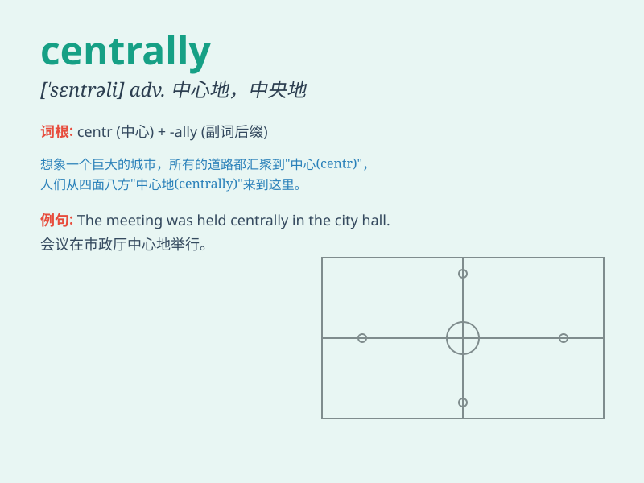

## centrally

**英音:** _[ˈsɛntrəli]_ **美音:** _[ˈsɛntrəli]_

**译义:** *adv.在中心,在中央*

### 短语

+ **centrally located:** _位于中心的_

+ **centrally controlled:** _集中控制的_

+ **centrally planned:** _中央计划的_

+ **centrally managed:** _集中管理的_

+ **centrally heated:** _集中供暖的_

### 例句

#### 例句1

> **The office is centrally located in the city.**

**中文翻译:** 这个办公室位于城市的中心位置。

**单词释义:** 在中心地

#### 例句2

> **The decision was made centrally by the management team.**

**中文翻译:** 这个决定是由管理团队集中做出的。

**单词释义:** 集中地

#### 例句3

> **The heating system is centrally controlled.**

**中文翻译:** 供暖系统是集中控制的。

**单词释义:** 集中

### 背诵小故事

> In a big city, there was a power outage. But the control center,
located centrally, managed to restore power quickly. People were
relieved as everything returned to normal thanks to the centrally placed
center\'s efficient work.

**在一个大城市里，发生了停电。但位于中心位置的控制中心迅速恢复了供电。由于处于中心位置的控制中心高效的工作，一切恢复正常，人们松了一口气。**

### 图义

