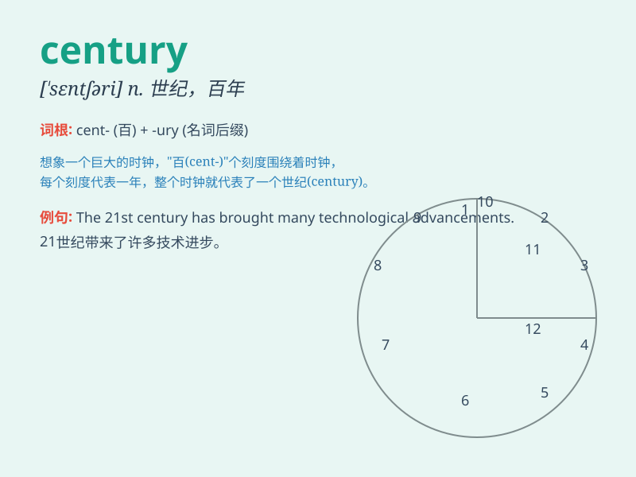

## century

**英音:** _[ˈsentʃərɪ]_ **美音:** _[ˈsɛntʃərɪ]_

**译义:** *n.世纪,百年,百个,板球中的一百分,百元(钞票)*

### 短语

+ **the turn of the century:** _世纪之交_

+ **for centuries:** _几个世纪以来_

+ **a new century:** _一个新的世纪_

+ **last century:** _上个世纪_

+ **in the 21st century:** _在 21 世纪_

### 例句

#### 例句1

> **The Great Pyramid of Giza was built over several centuries.**

**中文翻译:** 吉萨大金字塔的建造历经了好几个世纪。

**单词释义:** 世纪

#### 例句2

> **This castle has stood for five centuries.**

**中文翻译:** 这座城堡已经矗立了五个世纪。

**单词释义:** 世纪

#### 例句3

> **In the last century, many technological advancements were
made.**

**中文翻译:** 在上个世纪，取得了许多技术进步。

**单词释义:** 世纪

### 背诵小故事

> In a magical land, every time a wise old owl hooted 100 times, a new
century began. People marked these moments with great celebrations,
knowing it was a sign of time\'s passage and new beginnings.

**在一片神奇的土地上，每当一只智慧的老猫头鹰叫 100
次，一个新的世纪就开始了。人们会举行盛大的庆祝活动来标记这些时刻，深知这是时间流逝和新开端的标志。**

### 图义

