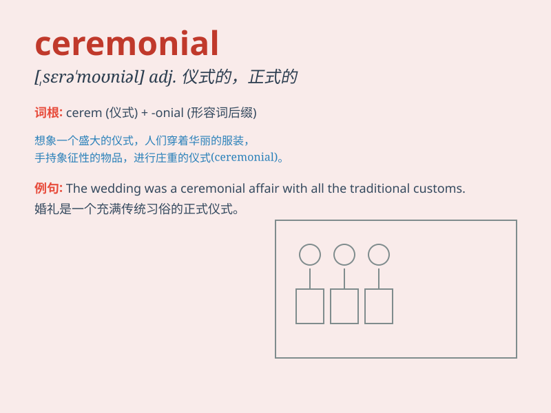

## ceremonial

**英音:** _[serɪ\'məʊnɪəl]_ **美音:** _[,sɛrɪ\'monɪəl]_

**译义:** *n.仪式adj.正式的*

### 短语

+ **ceremonial dress:** _礼服_

+ **ceremonial occasion:** _礼仪场合_

+ **ceremonial speech:** _礼仪性演讲_

+ **ceremonial opening:** _开幕式_

+ **ceremonial function:** _礼仪功能_

### 例句

#### 例句1

> **The wedding had a beautiful ceremonial procession.**

**中文翻译:** 这场婚礼有一个美丽的仪式队伍。

**单词释义:** 仪式性的

#### 例句2

> **He wore ceremonial robes for the special occasion.**

**中文翻译:** 他在这个特殊场合穿着礼仪长袍。

**单词释义:** 礼仪的

#### 例句3

> **The opening ceremony was a grand ceremonial event.**

**中文翻译:** 开幕式是一场盛大的仪式活动。

**单词释义:** 仪式的；礼节性的

### 背诵小故事

> A king\'s coronation was a grand ceremonial event. Everyone wore
special clothes and followed strict rules. The music and dance added to
the ceremonial atmosphere. It was a day filled with formality and
tradition.

**国王的加冕典礼是一场盛大的礼仪活动。每个人都穿着特殊的服装，遵循严格的规则。音乐和舞蹈增添了礼仪的氛围。这是充满正式和传统的一天。**

### 图义

