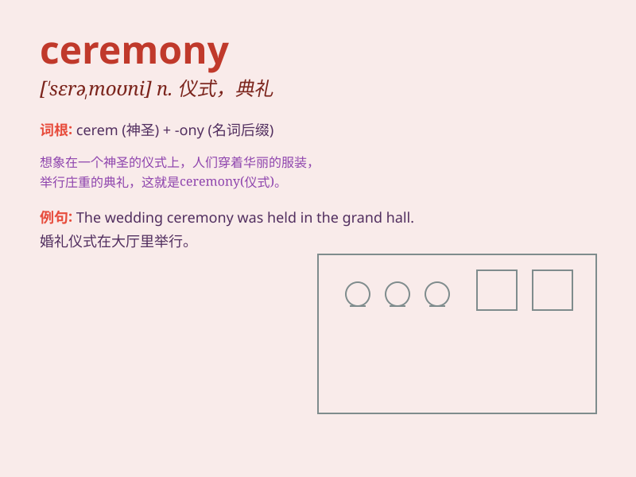

## ceremony

**英音:** _[\'serɪmənɪ]_ **美音:** _[ˈsɛrəˌmoʊni]_

**译义:** *n.典礼,仪式,礼节,报幕员*

### 短语

+ **opening ceremony:** _开幕式_

+ **wedding ceremony:** _婚礼_

+ **graduation ceremony:** _毕业典礼_

+ **closing ceremony:** _闭幕式_

+ **award ceremony:** _颁奖典礼_

### 例句

#### 例句1

> **The wedding ceremony was beautiful and touching.**

**中文翻译:** 这场婚礼仪式美丽而动人。

**单词释义:** 仪式

#### 例句2

> **The graduation ceremony marked the end of an important stage in
their lives.**

**中文翻译:** 毕业典礼标志着他们人生中一个重要阶段的结束。

**单词释义:** 典礼

#### 例句3

> **The opening ceremony of the Olympics is always a spectacular
event.**

**中文翻译:** 奥运会的开幕式总是一场壮观的盛事。

**单词释义:** 开幕式

### 背诵小故事

> A king was having a ceremony to celebrate his victory. There were
many people and beautiful decorations. The ceremony was so grand that
everyone remembered it.

**一位国王正在举行一个庆祝他胜利的典礼。有很多人以及漂亮的装饰。这个典礼如此盛大，以至于每个人都记住了它。**

### 图义

