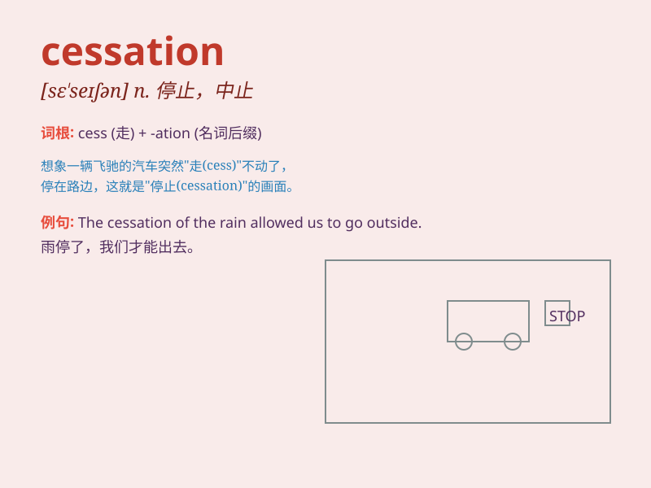

## cessation

**英音:** _[se\'seɪʃ(ə)n]_ **美音:** _[sɛ\'seʃən]_

**译义:** *n.停止*

### 短语

+ **cessation of hostilities:** _停止敌对行动_

+ **cessation of business:** _停业_

+ **cessation of smoking:** _戒烟_

+ **cessation of work:** _停工_

+ **cessation of rain:** _雨停_

### 例句

#### 例句1

> **The cessation of hostilities was greeted with relief by the
people.**

**中文翻译:** 敌对行动的停止让人们松了一口气。

**单词释义:** 停止，终止

#### 例句2

> **There was a sudden cessation of the noise in the room.**

**中文翻译:** 房间里的噪音突然停止了。

**单词释义:** 停止

#### 例句3

> **The doctor recommended the cessation of smoking for better
health.**

**中文翻译:** 医生建议为了更健康而停止吸烟。

**单词释义:** 停止

### 背诵小故事

> A brave adventurer was constantly on the move until he reached a
peaceful valley. There, he experienced a cessation of his journey and
found inner peace. The cessation meant an end to his restless wandering.

**一位勇敢的冒险家一直在行进，直到他到达一个宁静的山谷。在那里，他的旅程停止了，找到了内心的平静。cessation
意味着他不停歇的漫游结束了。**

### 图义

