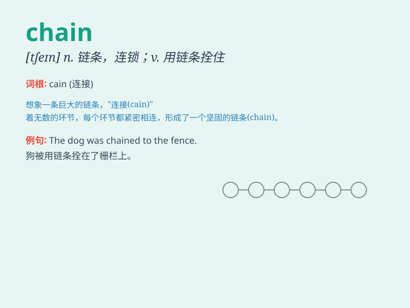

## chain

**英音:** _[tʃeɪn]_ **美音:** _[tʃen]_

**译义:** *n.链(条),[常 pl.] 镣铐,一连串,一系列vt.用链条拴住*

### 短语

+ **chain reaction:** _连锁反应_

+ **food chain:** _食物链_

+ **chain store:** _连锁店_

+ **chain letter:** _连锁信_

+ **ball and chain:** _沉重的负担；束缚_

### 例句

#### 例句1

> **The prisoner was chained to the wall.**

**中文翻译:** 囚犯被锁在墙上。

**单词释义:** 用链条拴住；束缚

#### 例句2

> **She wore a gold chain around her neck.**

**中文翻译:** 她脖子上戴着一条金链子。

**单词释义:** 链子；链条

#### 例句3

> **The supermarket chain has many branches.**

**中文翻译:** 这家连锁超市有很多分店。

**单词释义:** 连锁；连锁店

### 背诵小故事

> A thief was trying to escape, but the police used a chain to lock him
up. The chain was so strong that he couldn\'t break free. Remember,
chain means a series of connected metal links.

**一个小偷试图逃跑，但警察用一条链子把他锁了起来。这条链子非常坚固，他无法挣脱。记住，chain
意思是链条。**

### 图义

