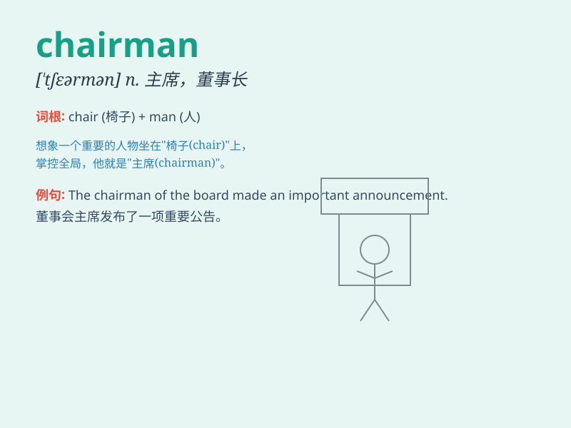

## chairman

**英音:** _[\'tʃeəmən]_ **美音:** _[\'tʃɛrmən]_

**译义:** *n.主席,会长*

### 短语

+ **board chairman:** _董事会主席_

+ **honorary chairman:** _名誉主席_

+ **chairman of the committee:** _委员会主席_

+ **former chairman:** _前任主席_

+ **acting chairman:** _代理主席_

### 例句

#### 例句1

> **The chairman of the company made an important decision.**

**中文翻译:** 公司董事长做出了一个重要决定。

**单词释义:** 董事长

#### 例句2

> **The chairman presided over the meeting.**

**中文翻译:** 会议由董事长主持。

**单词释义:** 主席

#### 例句3

> **The new chairman has a lot of plans for the organization.**

**中文翻译:** 新任主席对该组织有很多计划。

**单词释义:** 主席

### 背诵小故事

>
想象一下，在一个重要的会议上，有一把特别的椅子（chair），坐在这把椅子上的人（man）拥有最大的权力，能做重要决定，这个人就是
chairman，也就是主席、董事长。

**想象在重要会议上，坐特别椅子的人是主席、董事长**

### 图义

