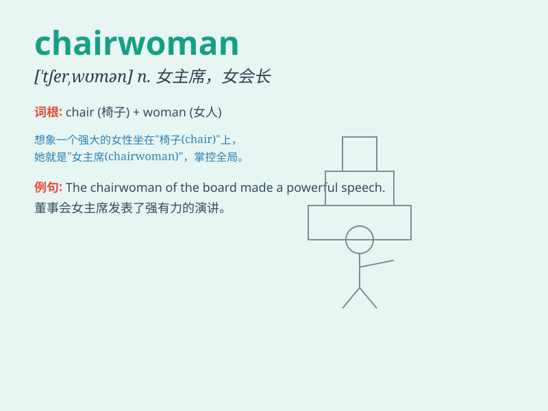

## chairwoman

**英音:** _[ˈtʃeəwʊmən]_ **美音:** _[ˈtʃerwʊmən]_

**译义:** *n.女主席,女议长*

### 短语

+ **elected chairwoman:** _当选的女主席_

+ **company chairwoman:** _公司女董事长_

+ **honorable chairwoman:** _尊敬的女主席_

+ **former chairwoman:** _前任女主席_

+ **new chairwoman:** _新的女主席_

### 例句

#### 例句1

> **The chairwoman of the company delivered an inspiring speech at
the annual meeting.**

**中文翻译:** 公司董事长在年会上发表了鼓舞人心的讲话。

**单词释义:** 女主席；女董事长

#### 例句2

> **The chairwoman presided over the meeting with great
efficiency.**

**中文翻译:** 会议主席主持得非常有效率。

**单词释义:** 女主席；女主持人

#### 例句3

> **She was elected as the chairwoman of the charity
organization.**

**中文翻译:** 她被选为该慈善组织的主席。

**单词释义:** 女主席

### 背诵小故事

> Once upon a time, there was a powerful leader. She sat on a special
chair and made important decisions for everyone. People called her the
chairwoman. She was respected and trusted.

**从前，有一位强大的领导者。她坐在一把特殊的椅子上为大家做重要决定。人们称她为女主席。她受人尊敬和信任。**

### 图义

