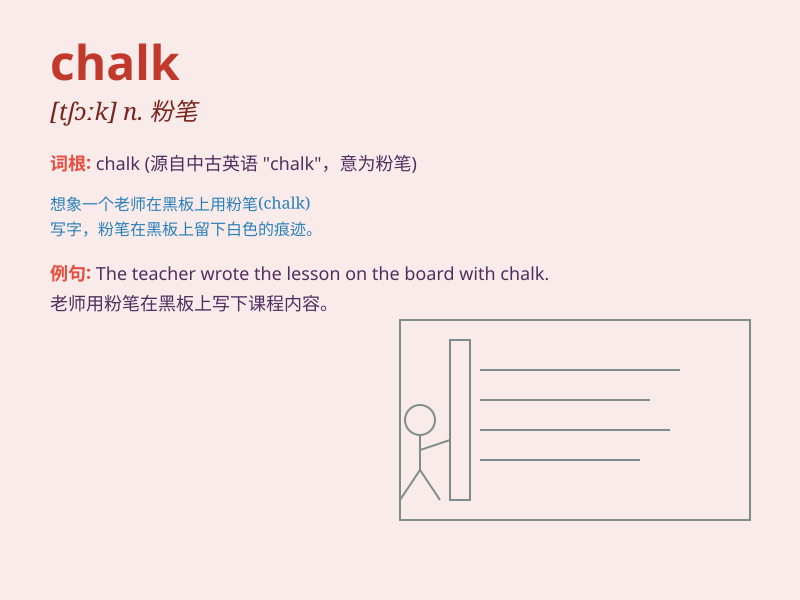

## chalk

**英音:** _[tʃɔːk]_ **美音:** _[tʃɔk]_

**译义:** *n.粉笔,白垩vt.用粉笔写,和以白垩*

### 短语

+ **chalk up:** _归因于；取得；记下_

+ **chalk out:** _用粉笔画出；规划_

+ **chalk and cheese:** _截然不同；天壤之别_

+ **a piece of chalk:** _一支粉笔_

+ **write in chalk:** _用粉笔写_

### 例句

#### 例句1

> **The teacher wrote on the blackboard with chalk.**

**中文翻译:** 老师用粉笔在黑板上写着。

**单词释义:** 粉笔

#### 例句2

> **The ground was as white as chalk.**

**中文翻译:** 地面像粉笔一样白。

**单词释义:** 粉笔；白垩

#### 例句3

> **You can chalk up his success to hard work.**

**中文翻译:** 你可以把他的成功归功于努力工作。

**单词释义:** 用粉笔写；记下

### 背诵小故事

> One day, a teacher was writing on the blackboard with a piece of
chalk. The chalk made a squeaky sound as it left marks. The students
watched carefully, knowing that the chalk was the key to learning.

**有一天，一位老师正用一根粉笔在黑板上写字。粉笔留下痕迹时发出吱吱的声音。学生们仔细看着，知道粉笔是学习的关键。**

### 图义

