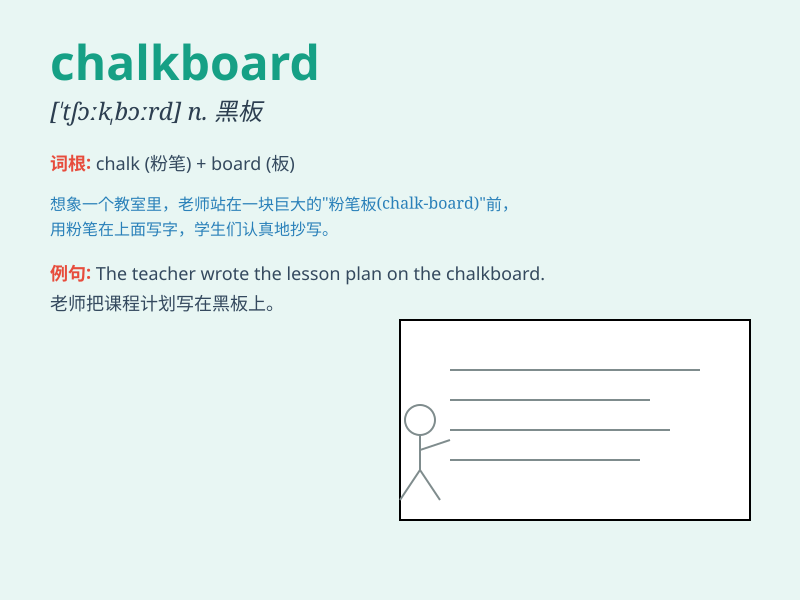

## chalkboard

**英音:** _[\'tʃɔːkbɔːd]_ **美音:** _[\'tʃɔkbɔrd]_

**译义:** *n.黑板*

### 短语

+ **write on the chalkboard:** _在黑板上写字_

+ **clean the chalkboard:** _擦黑板_

+ **look at the chalkboard:** _看黑板_

+ **point to the chalkboard:** _指向黑板_

+ **erase the chalkboard:** _擦掉黑板上的（字等）_

### 例句

#### 例句1

> **The teacher wrote the lesson on the chalkboard.**

**中文翻译:** 老师把课文写在黑板上。

**单词释义:** 黑板

#### 例句2

> **He cleaned the chalkboard before class.**

**中文翻译:** 上课前他擦黑板。

**单词释义:** 黑板

#### 例句3

> **The chalkboard was full of math problems.**

**中文翻译:** 黑板上写满了数学题。

**单词释义:** 黑板

### 背诵小故事

> One day, the teacher pointed to the chalkboard and said, \'Look,
kids! This is a chalkboard where I write important knowledge for you.\'
The students stared at the chalkboard intently.

**有一天，老师指着黑板说：'看，孩子们！这是一块黑板，我在上面为你们写重要的知识。'学生们专注地盯着黑板。**

### 图义

