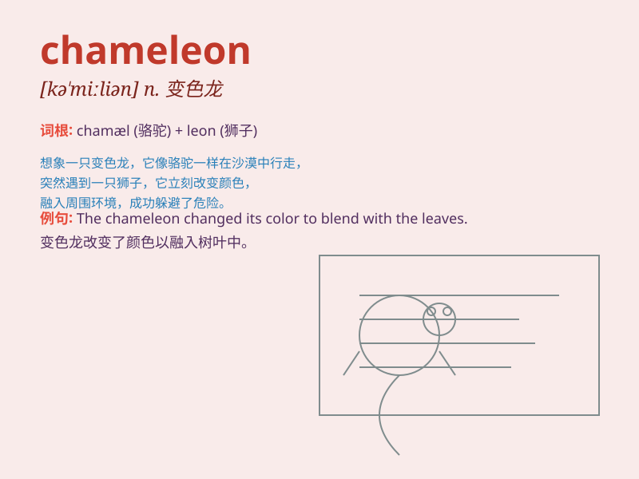

## chameleon

**英音:** _[kə\'miːlɪən]_ **美音:** _[kə\'miljən]_

**译义:** *n.变色龙*

### 短语

+ **color-changing chameleon:** _变色的变色龙_

+ **chameleon skin:** _变色龙的皮肤_

+ **camouflaging chameleon:** _伪装的变色龙_

+ **fast-moving chameleon:** _快速移动的变色龙_

+ **rare chameleon species:** _稀有的变色龙物种_

### 例句

#### 例句1

> **The chameleon changed its color to blend in with the green
leaves.**

**中文翻译:** 变色龙改变了颜色，与绿叶融为一体。

**单词释义:** 变色龙

#### 例句2

> **He is like a chameleon, constantly changing his personality to
fit the situation.**

**中文翻译:** 他就像一条变色龙，不断改变自己的性格以适应情况。

**单词释义:** 像变色龙一样的人；善变的人

#### 例句3

> **The fashion industry is full of chameleons who follow every new
trend.**

**中文翻译:** 时尚界充满了追随每一种新趋势的变色龙。

**单词释义:** 善变的人

### 背诵小故事

> One day, a little boy saw a chameleon in the forest. The chameleon
could change its color to blend in with the surroundings. It was so
amazing! The boy was deeply impressed by this magical creature.

**有一天，一个小男孩在森林里看到一只变色龙。变色龙能够改变自身颜色来融入周围环境。这太神奇了！这个神奇的生物给小男孩留下了深刻的印象。**

### 图义

