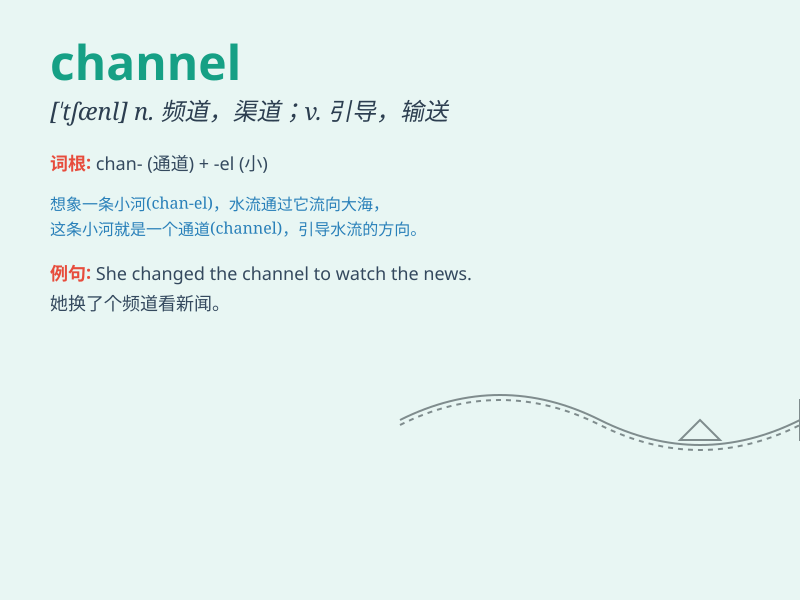

## channel

**英音:** _[\'tʃæn(ə)l]_ **美音:** _[\'tʃænl]_

**译义:** *n.海峡,水道,沟,路线vt.引导,开导,形成河道 信道,频道*

### 短语

+ **television channel:** _电视频道_

+ **communication channel:** _通信渠道_

+ **distribution channel:** _分销渠道_

+ **marketing channel:** _营销渠道_

+ **data channel:** _数据通道_

### 例句

#### 例句1

> **The television channel broadcasts news all day long.**

**中文翻译:** 电视频道全天播放新闻。

**单词释义:** 频道

#### 例句2

> **We need to channel our energy into productive work.**

**中文翻译:** 我们需要将精力投入到富有成效的工作中。

**单词释义:** 引导；集中

#### 例句3

> **The river forms several channels as it flows through the
delta.**

**中文翻译:** 河流流经三角洲时形成数条河道。

**单词释义:** 水道；渠道

### 背诵小故事

>
想象你是一位勇敢的探险家，在一片神秘的海域航行。突然，你发现了一条独特的\'channel\'，它就像一条神奇的水路，引导着你的船只安全地到达目的地。

**想象你是一位勇敢的探险家，在一片神秘的海域航行。突然，你发现了一条独特的'航道'，它就像一条神奇的水路，引导着你的船只安全地到达目的地。**

### 图义

