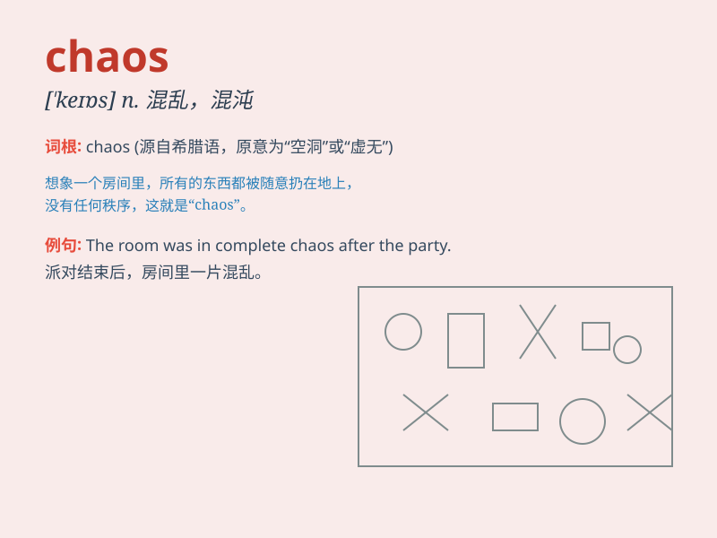

## chaos

**英音:** _[\'keɪɒs]_ **美音:** _[\'keɑs]_

**译义:** *n.混乱,混沌(宇宙未形成前的情形)*

### 短语

+ **in chaos:** _处于混乱状态_

+ **chaos theory:** _混沌理论_

+ **create chaos:** _制造混乱_

+ **total chaos:** _完全混乱_

+ **descend into chaos:** _陷入混乱_

### 例句

#### 例句1

> **The country was in chaos after the war.**

**中文翻译:** 战后国家陷入混乱。

**单词释义:** 混乱；杂乱；紊乱

#### 例句2

> **The room was in chaos when I came back.**

**中文翻译:** 当我回来时，房间里一片混乱。

**单词释义:** 混乱状态

#### 例句3

> **The traffic was in chaos during the rush hour.**

**中文翻译:** 高峰时段交通十分混乱。

**单词释义:** 混乱的局面

### 背诵小故事

> In a strange land, everything was in chaos. People ran around
aimlessly, and buildings collapsed. It was like a nightmare. But then a
hero emerged and started to restore order, turning the chaos into peace.

**在一片陌生的土地上，一切都处于混乱之中。人们漫无目的地乱跑，建筑物倒塌。这就像一场噩梦。但随后一位英雄出现，开始恢复秩序，将混乱变为和平。**

### 图义

