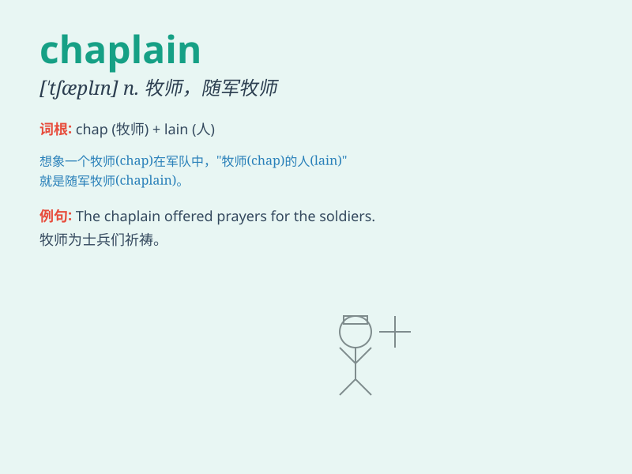

## chaplain

**英音:** _[\'tʃæplɪn]_ **美音:** _[\'tʃæplɪn]_

**译义:**
*n.(私人、社团、医院、监狱、贵族、私人教堂、军中等的)牧师*

### 短语

+ **military chaplain:** _随军牧师_

+ **hospital chaplain:** _医院牧师_

+ **prison chaplain:** _监狱牧师_

+ **chaplain service:** _牧师服务_

+ **chaplaincy duties:** _牧师职责_

### 例句

#### 例句1

> **The chaplain provided spiritual support to the soldiers during
the war.**

**中文翻译:** 牧师在战争期间为士兵们提供了精神支持。

**单词释义:** 牧师

#### 例句2

> **The hospital chaplain visited the patients every day to offer
comfort.**

**中文翻译:** 医院牧师每天都会探望病人，安慰他们。

**单词释义:** 牧师

#### 例句3

> **The chaplain conducted a prayer service for the school
community.**

**中文翻译:** 牧师为学校社区进行了祈祷活动。

**单词释义:** 牧师

### 背诵小故事

> A chaplain was invited to a big party. But he got lost on the way.
Luckily, a kind girl guided him. When he finally arrived, everyone was
happy. The chaplain brought peace and joy to the party.

**一位牧师被邀请去一个大型聚会。但他在路上迷路了。幸运的是，一个善良的女孩给他指路。当他最终到达时，每个人都很高兴。这位牧师给聚会带来了和平与欢乐。**

### 图义

