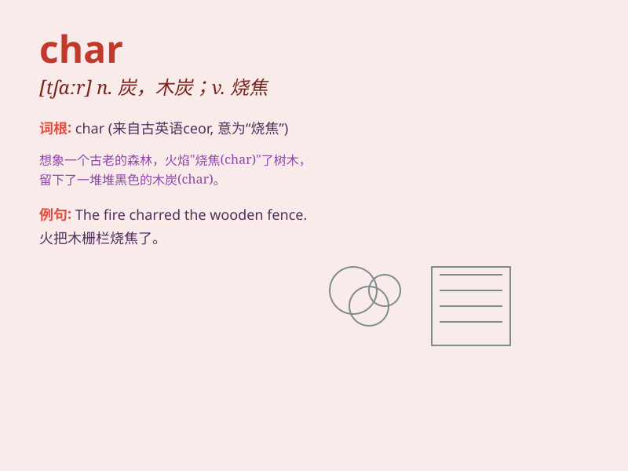

## char

**英音:** _[tʃɑː]_ **美音:** _[tʃɑr]_

**译义:** *v.烧焦*

### 短语

+ **char woman:** _打杂的女佣_

+ **char work:** _打杂的工作_

+ **charred wood:** _烧焦的木头_

+ **charcoal burner:** _烧炭工人_

+ **charitable donation:** _慈善捐赠_

### 例句

#### 例句1

> **She charred the steak on the grill.**

**中文翻译:** 她把牛排放在烤架上烤焦了。

**单词释义:** 把\...烧焦

#### 例句2

> **The fire charred the wooden beams of the house.**

**中文翻译:** 大火烧焦了房子的木梁。

**单词释义:** 烧焦

#### 例句3

> **He was hired to char for the family.**

**中文翻译:** 他被雇来为家里烧钱。

**单词释义:** 做杂役

### 背诵小故事

> A witch was casting a magic spell. She needed to char some special
wood to release the power. But she was too careless and charred her own
dress. Now you know \'char\' means to burn and blacken something by
fire.

**一位女巫正在施魔法。她需要烧焦一些特殊的木头来释放力量。但她太粗心了，把自己的裙子烧焦了。现在你知道'char'意思是用火把某物烧焦变黑。**

### 图义

