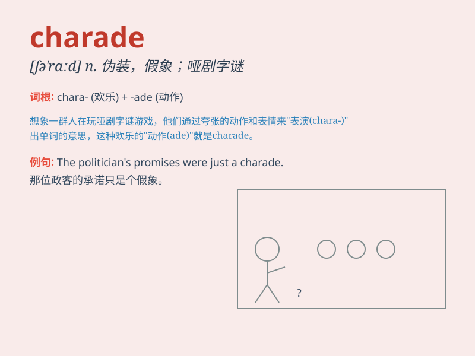

## charade

**英音:** _[ʃə\'rɑːd]_ **美音:** _[ʃə\'red]_

**译义:** *n.看手势猜字谜游戏*

### 短语

+ **play a charade:** _玩猜谜游戏_

+ **charade of peace:** _和平的假象_

+ **charade of unity:** _团结的伪装_

+ **unmask the charade:** _揭露伪装_

+ **see through the charade:** _看穿骗局_

### 例句

#### 例句1

> **The whole political process was a charade.**

**中文翻译:** 整个政治进程就是一场猜谜游戏。

**单词释义:** 骗局；装模作样

#### 例句2

> **Their marriage had become a charade of happiness.**

**中文翻译:** 他们的婚姻已经成为一场幸福的闹剧。

**单词释义:** 虚假的表象

#### 例句3

> **The interview was a charade to hide the truth.**

**中文翻译:** 这次采访是一场掩盖真相的骗局。

**单词释义:** 伪装；掩饰

### 背诵小故事

>
想象一下，在一个神秘的派对上，人们都戴着面具玩猜谜游戏。每个人的动作和表情都像是一场伪装的表演，这就是
charade（伪装；猜字谜游戏）。

**想象在神秘派对上人们戴面具玩猜谜游戏来体现 charade
这个单词，意思是伪装；猜字谜游戏**

### 图义

