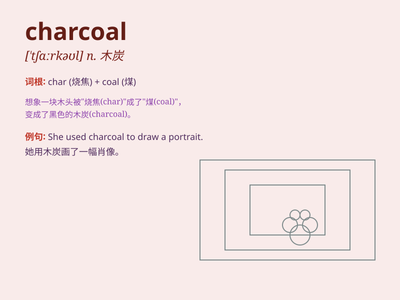

## charcoal

**英音:** _[\'tʃɑːkəʊl]_ **美音:** _[\'tʃɑrkol]_

**译义:** *n.木炭*

### 短语

+ **charcoal drawing:** _炭笔画_

+ **charcoal burner:** _烧炭工；木炭炉_

+ **charcoal grey:** _深灰色；炭灰色_

+ **activated charcoal:** _活性炭_

+ **charcoal filter:** _木炭过滤器_

### 例句

#### 例句1

> **The artist used charcoal to draw a portrait.**

**中文翻译:** 艺术家用木炭画了一幅肖像。

**单词释义:** 木炭

#### 例句2

> **We need to buy some charcoal for the barbecue.**

**中文翻译:** 我们需要买一些烧烤用的木炭。

**单词释义:** 木炭

#### 例句3

> **The charcoal sketch captured the essence of the scene.**

**中文翻译:** 炭笔素描抓住了场景的精髓。

**单词释义:** 木炭；用木炭画的画

### 背诵小故事

> A brave artist was painting in a forest. Suddenly, his paints ran
out. But he found some wood and made charcoal to continue his art. The
charcoal helped him create a beautiful picture.

**一位勇敢的艺术家正在森林里画画。突然，他的颜料用完了。但他找到了一些木头并制成了木炭，以继续他的艺术创作。木炭帮助他创作了一幅美丽的画。**

### 图义

