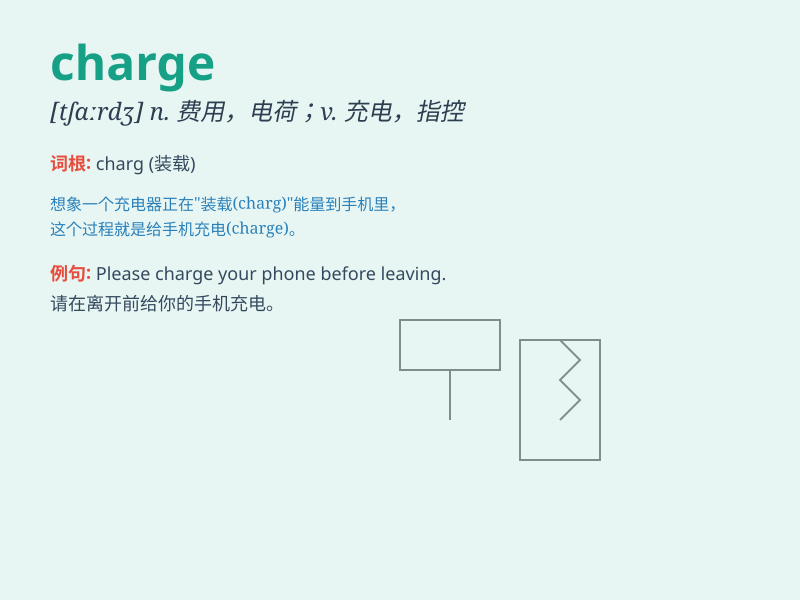

## charge

**英音:** _[tʃɑːdʒ]_ **美音:** _[tʃɑrdʒ]_

**译义:**
*n.负荷,电荷,费用,主管,掌管,充电,充气,装料v.装满,控诉,责令,告诫,指示,加罪于,冲锋,收费*

### 短语

+ **in charge:** _负责；主管_

+ **take charge:** _掌管；负责_

+ **charge for:** _要价；收费_

+ **free of charge:** _免费_

+ **charge sb. with sth.:** _指控某人犯某事_

### 例句

#### 例句1

> **The police officer charged the suspect with theft.**

**中文翻译:** 警察指控嫌疑人盗窃。

**单词释义:** 指控；控告

#### 例句2

> **He was in charge of the project.**

**中文翻译:** 他负责该项目。

**单词释义:** 负责；主管

#### 例句3

> **How much do you charge for a haircut?**

**中文翻译:** 你们理发要多少钱？

**单词释义:** 收费；索价

### 背诵小故事

> A brave knight was in charge of defending the castle. One day, an
enemy army charged towards the castle. The knight led his soldiers to
fight and they successfully charged the enemy back.

**一位勇敢的骑士负责守卫城堡。有一天，一支敌军向城堡冲锋。骑士带领他的士兵作战，他们成功地向敌军反击。**

### 图义

