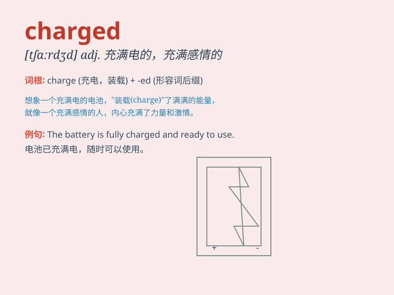

## charged

**英音:** _[tʃɑːdʒd]_ **美音:** _[tʃɑːrdʒd]_

**译义:** *adj. 带电的；充满感情的；气氛紧张的*

### 短语

+ **charged particle:** _带电粒子_

+ **charged with:** _被指控；承担_

+ **electrically charged:** _带电的；充电的_

+ **charged atmosphere:** _紧张的气氛_

+ **highly charged:** _高度紧张的；情绪激动的_

### 例句

#### 例句1

> **The atmosphere in the room was charged with excitement.**

**中文翻译:** 房间里的气氛充满了兴奋。

**单词释义:** 充满

#### 例句2

> **He was charged with theft.**

**中文翻译:** 他被指控犯有盗窃罪。

**单词释义:** 指控

#### 例句3

> **The battery is fully charged.**

**中文翻译:** 电池已充满电。

**单词释义:** 充电

### 背诵小故事

> A brave knight was charged with the important task of protecting the
kingdom. He felt a strong sense of responsibility as he was given this
charged mission.

**一位勇敢的骑士被赋予了保护王国的重要任务。当他被给予这个艰巨的使命时，他感到了强烈的责任感。**

### 图义

