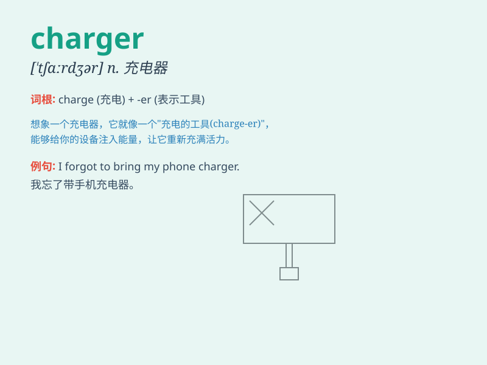

## charger

**英音:** _[\'tʃɑːdʒə]_ **美音:** _[\'tʃɑrdʒɚ]_

**译义:** *n.充电器,军马,袭击者*

### 短语

+ **battery charger:** _电池充电器_

+ **phone charger:** _手机充电器_

+ **electric charger:** _电动充电器_

+ **fast charger:** _快速充电器_

+ **wireless charger:** _无线充电器_

### 例句

#### 例句1

> **The charger for my phone is not working properly.**

**中文翻译:** 我的手机充电器无法正常工作。

**单词释义:** 充电器

#### 例句2

> **He left his laptop charger at home.**

**中文翻译:** 他把笔记本电脑充电器落在家里了。

**单词释义:** 充电器

#### 例句3

> **The horse charger was strong and powerful.**

**中文翻译:** 战马威猛有力。

**单词释义:** 战马

### 背诵小故事

> A brave knight was on a long journey. His horse was tired, but
luckily he found a charger - a powerful and energetic horse that helped
him continue his adventure. With the charger, the knight could move fast
and reach his destination.

**一位勇敢的骑士正在长途旅行。他的马累了，但幸运的是他找到了一匹战马------一匹强大而精力充沛的马，帮助他继续他的冒险。有了这匹战马，骑士能够快速前进并到达目的地。**

### 图义

