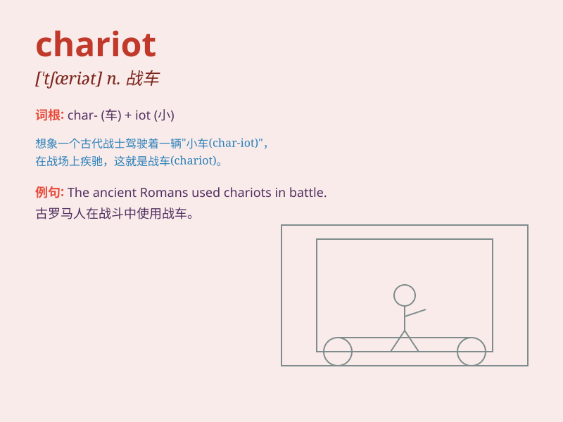

## chariot

**英音:** _[\'tʃærɪət]_ **美音:** _[\'tʃærɪət]_

**译义:** *n.战车*

### 短语

+ **war chariot:** _战车_

+ **chariot race:** _赛车比赛_

+ **royal chariot:** _皇家马车_

+ **pull a chariot:** _拉一辆马车_

+ **ride in a chariot:** _乘坐马车_

### 例句

#### 例句1

> **The ancient warriors rode into battle in chariots.**

**中文翻译:** 古代武士乘坐战车参加战斗。

**单词释义:** 战车

#### 例句2

> **The chariot was pulled by two horses.**

**中文翻译:** 战车由两匹马拉着。

**单词释义:** 战车

#### 例句3

> **She imagined herself as a queen in a golden chariot.**

**中文翻译:** 她想象自己是一位坐在金色战车上的女王。

**单词释义:** 战车

### 背诵小故事

> In ancient times, a brave warrior named Tom always rode a chariot
into battle. The chariot was decorated with colorful flags and shiny
metals. It was his powerful weapon and companion. With it, Tom won many
victories.

**在古代，有个叫汤姆的勇敢战士总是乘着一辆双轮战车进入战场。这辆战车装饰着五彩的旗帜和闪亮的金属。它是他强大的武器和伙伴。凭借它，汤姆赢得了许多胜利。**

### 图义

