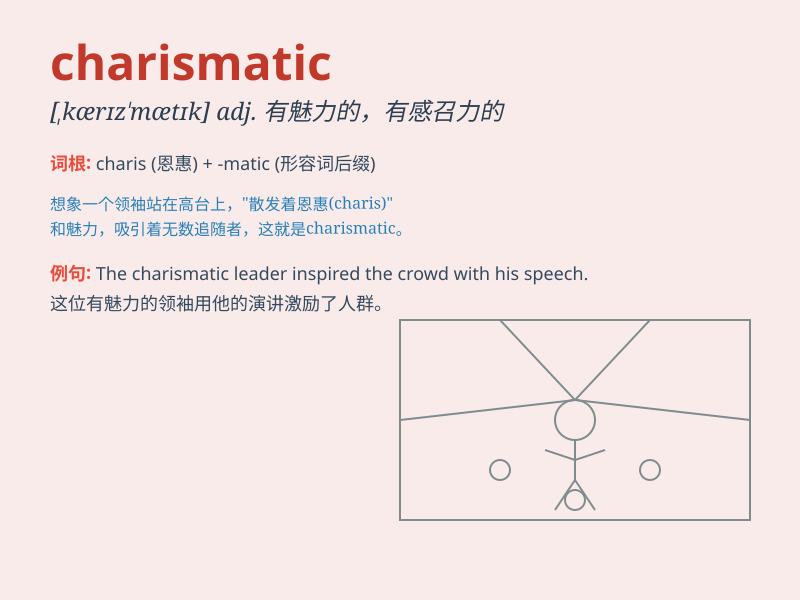

## charismatic

**英音:** _[kærɪz\'mætɪk]_ **美音:** _[,kærɪz\'mætɪk]_

**译义:** *adj.神赐能力的,超凡魅力的*

### 短语

+ **charismatic leader:** _有魅力的领袖_

+ **charismatic personality:** _有魅力的个性_

+ **charismatic charm:** _魅力非凡的吸引力_

+ **charismatic speaker:** _有魅力的演讲者_

+ **charismatic movement:**
_魅力运动（指具有强烈吸引力和影响力的宗教或社会运动）_

### 例句

#### 例句1

> **The politician was charismatic and could easily win the hearts of
the people.**

**中文翻译:** 这位政治家很有魅力，很容易赢得民心。

**单词释义:** 富有魅力的

#### 例句2

> **She has a charismatic personality that attracts many friends.**

**中文翻译:** 她具有超凡魅力，吸引了很多朋友。

**单词释义:** 有魅力的

#### 例句3

> **The charismatic leader inspired his team to achieve great
success.**

**中文翻译:** 这位富有魅力的领导者激励他的团队取得巨大成功。

**单词释义:** 魅力非凡的

### 背诵小故事

> A young leader was giving a speech. Everyone was attracted by his
charm and energy. He had a charismatic personality that made people
believe in him. His words and expressions were so powerful. That\'s what
\'charismatic\' means.

**一位年轻的领导者正在发表演讲。每个人都被他的魅力和活力所吸引。他具有魅力非凡的个性，让人们信任他。他的言语和表情极具影响力。这就是\'charismatic\'的意思。**

### 图义

