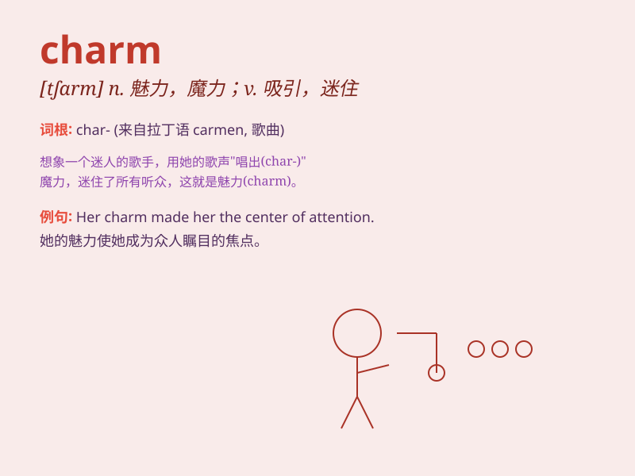

## charm

**英音:** _[tʃɑːm]_ **美音:** _[tʃɑrm]_

**译义:**
*n.吸引力,(女人的)魔力,魅力,符咒vt.迷人,使陶醉,行魔法vi.用符咒,有魔力*

### 短语

+ **charm offensive:**
_魅力攻势（指为了赢得他人支持或好感而采取的一系列吸引人的行动）_

+ **lucky charm:** _幸运符；幸运物_

+ **personal charm:** _个人魅力_

+ **animal charm:** _动物的魅力_

+ **charm bracelet:** _带有饰物的手镯_

### 例句

#### 例句1

> **Her charm lies in her kindness and intelligence.**

**中文翻译:** 她的魅力在于她的善良和聪明。

**单词释义:** 魅力；吸引力

#### 例句2

> **The witch used a charm to turn the prince into a frog.**

**中文翻译:** 女巫用咒语把王子变成了青蛙。

**单词释义:** 符咒；魔法

#### 例句3

> **He was charmed by her smile.**

**中文翻译:** 他被她的笑容迷住了。

**单词释义:** 使陶醉；使着迷

### 背诵小故事

> A fairy had a charm that could make everyone happy. One day, a sad
boy met the fairy. She used the charm and the boy\'s smile came back.
The charm was like magic, bringing joy wherever it went.

**一个仙女有一个魅力，能让每个人都开心。有一天，一个悲伤的男孩遇到了仙女。她使用了魅力，男孩的笑容回来了。这个魅力就像魔法，所到之处带来欢乐。**

### 图义

