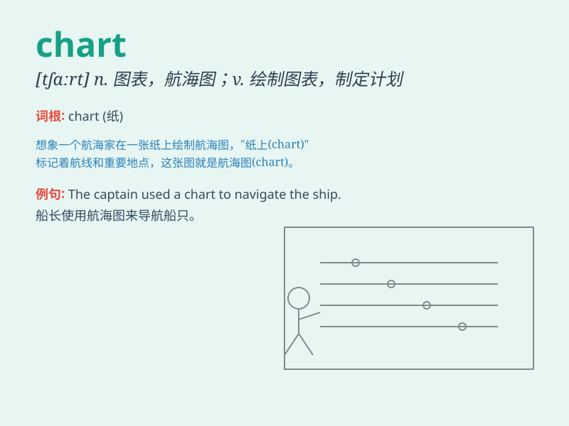

## chart

**英音:** _[tʃɑːt]_ **美音:** _[tʃɑrt]_

**译义:** *n.海图,图表vt.制图*

### 短语

+ **bar chart:** _条形图；柱状图_

+ **flow chart:** _流程图；作业图_

+ **pie chart:** _饼图_

+ **temperature chart:** _温度图表_

+ **sales chart:** _销售图表_

### 例句

#### 例句1

> **The doctor studied the patient\'s chart carefully.**

**中文翻译:** 医生仔细研究了病人的病历。

**单词释义:** 图表；病历表

#### 例句2

> **The sales chart shows a significant increase this month.**

**中文翻译:** 从销售图表来看，本月销量大幅增长。

**单词释义:** 图表

#### 例句3

> **We need to chart a new course for the project.**

**中文翻译:** 我们需要为该项目制定新的路线。

**单词释义:** 制定；规划

### 背诵小故事

> A brave sailor was lost at sea. He had only a chart to guide him. The
chart showed the way to the nearest island. With its help, he finally
reached safety. Remember, a chart can save you!

**一位勇敢的水手在海上迷路了。他只有一张航海图来指引方向。这张图显示了去最近岛屿的路线。在它的帮助下，他最终安全抵达。记住，chart（图表、航海图）能拯救你！**

### 图义

