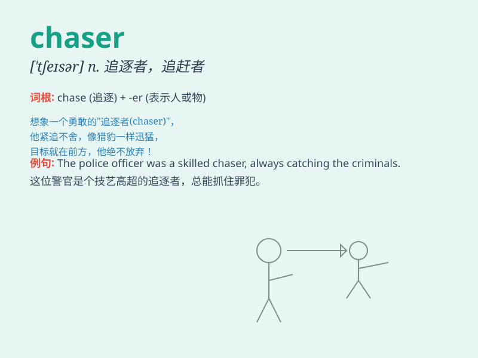

## chaser

**英音:** _[\'tʃeɪsə]_ **美音:** _[\'tʃesɚ]_

**译义:** *n.猎人,驱逐舰*

### 短语

+ **drink chaser:** _喝一口酒接着喝一口水等_

+ **storm chaser:** _风暴追逐者_

+ **chaser aircraft:** _护航机_

+ **chaser diode:** _箝位二极管_

+ **chaser mill:** _随动轧机_

### 例句

#### 例句1

> **The police car was the chaser in the high-speed pursuit.**

**中文翻译:** 警车在高速追捕中是追逐者。

**单词释义:** 追逐者

#### 例句2

> **She\'s a chaser of dreams, never giving up on her
aspirations.**

**中文翻译:** 她是梦想的追逐者，从不放弃自己的抱负。

**单词释义:** 追逐者；追求者

#### 例句3

> **The dog became the chaser when it saw the cat running away.**

**中文翻译:** 当狗看到猫跑开时，它变成了追逐者。

**单词释义:** 追逐者

### 背诵小故事

> One day, a little rabbit was running in the forest. Suddenly, it
noticed a chaser behind it. The chaser was a fierce wolf. The little
rabbit had to run as fast as it could to escape.

**一天，一只小兔子在森林里跑。突然，它注意到身后有个追逐者。这个追逐者是一只凶猛的狼。小兔子不得不拼命跑以逃脱。**

### 图义

