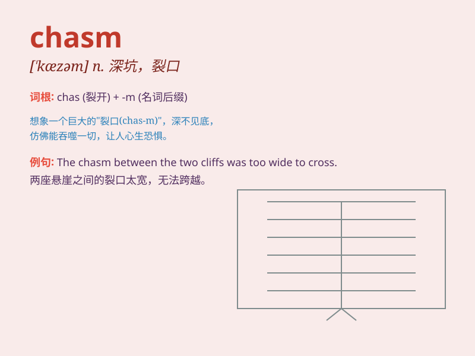

## chasm

**英音:** _[\'kæz(ə)m]_ **美音:** _[\'kæzəm]_

**译义:** *n.深坑,裂口*

### 短语

+ **bridge the chasm:** _弥合差距_

+ **wide chasm:** _宽阔的裂口_

+ **deep chasm:** _幽深的峡谷_

+ **yawning chasm:** _张开大口的裂隙_

+ **vast chasm:** _巨大的深渊_

### 例句

#### 例句1

> **The chasm between the rich and the poor is widening.**

**中文翻译:** 富人和穷人之间的差距正在扩大。

**单词释义:** 差距；分歧

#### 例句2

> **He stared into the chasm, filled with fear.**

**中文翻译:** 他凝视着深渊，满心恐惧。

**单词释义:** 深渊；深谷

#### 例句3

> **There is a chasm in understanding between the two sides of the
debate.**

**中文翻译:** 辩论双方在理解上存在巨大分歧。

**单词释义:** 分歧；隔阂

### 背诵小故事

> A brave adventurer was crossing a mountain. Suddenly, he encountered
a deep and wide chasm. He had to find a way to jump over it to continue
his journey. The chasm was like a big gap blocking his path.

**一位勇敢的冒险家正在穿越一座山。突然，他遇到了一个又深又宽的裂口。他必须想办法跳过去才能继续他的旅程。这个裂口就像一个巨大的缺口挡住了他的路。**

### 图义

