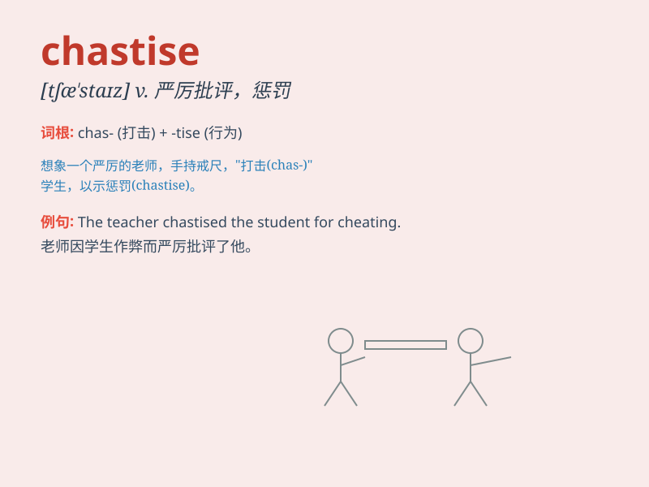

## chastise

**英音:** _[tʃæ\'staɪz]_ **美音:** _[tʃæ\'staɪz]_

**译义:** *vt.严惩,惩罚*

### 短语

+ **chastise severely:** _严厉地惩罚_

+ **chastise publicly:** _公开地斥责_

+ **chastise oneself:** _自我谴责_

+ **chastise unjustly:** _不公正地惩罚_

+ **chastise morally:** _从道德上谴责_

### 例句

#### 例句1

> **The teacher chastised the student for not doing his homework.**

**中文翻译:** 老师因学生没做作业而斥责了他。

**单词释义:** 斥责；惩罚

#### 例句2

> **He was chastised by his boss for making a serious mistake at
work.**

**中文翻译:** 他因在工作中犯了一个严重的错误而受到老板的严厉批评。

**单词释义:** 严厉批评；惩罚

#### 例句3

> **The coach chastised the team for their poor performance in the
game.**

**中文翻译:** 教练因球队在比赛中的糟糕表现而训斥了他们。

**单词释义:** 训斥；责罚

### 背诵小故事

> A naughty child broke the vase. The angry mother decided to chastise
him. She sternly scolded and punished him, making him understand that
bad behavior has consequences.

**一个顽皮的孩子打碎了花瓶。愤怒的母亲决定惩戒他。她严厉地训斥并惩罚了他，让他明白不良行为是有后果的。**

### 图义

