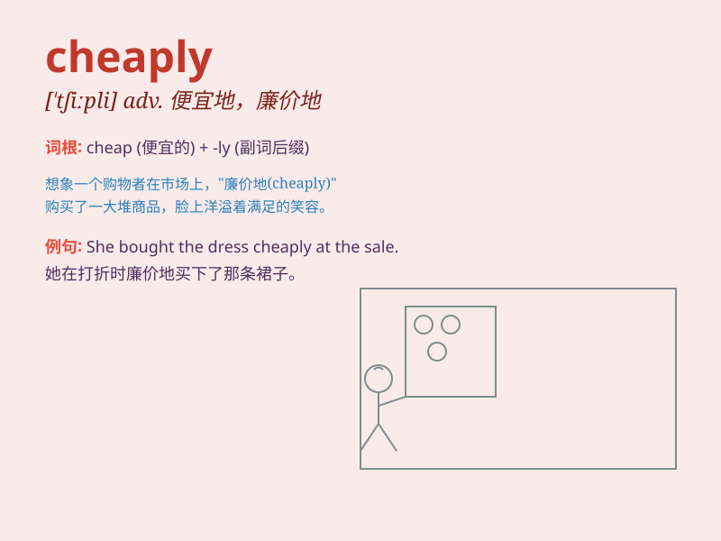

## cheaply

**英音:** _[ˈtʃiːpli]_ **美音:** _[ˈtʃiːpli]_

**译义:** *adv.便宜地*

### 短语

+ **buy cheaply:** _便宜地购买_

+ **sell cheaply:** _廉价出售_

+ **produce cheaply:** _低成本生产_

+ **travel cheaply:** _便宜地旅行_

+ **live cheaply:** _生活俭省_

### 例句

#### 例句1

> **The dress was made cheaply, but it still looked nice.**

**中文翻译:** 这件连衣裙制作成本低廉，但看起来仍然不错。

**单词释义:** 低廉地

#### 例句2

> **They traveled cheaply by taking the night train.**

**中文翻译:** 他们乘坐夜间火车出行，费用很低。

**单词释义:** 便宜地

#### 例句3

> **The company produced the goods cheaply to increase profits.**

**中文翻译:** 这家公司以低成本生产商品以增加利润。

**单词释义:** 廉价地

### 背诵小故事

> One day, I went shopping. I found a beautiful dress sold cheaply. I
was so happy because I could buy it without spending too much money. It
was a great deal!

**有一天，我去购物。我发现一件漂亮的裙子卖得很便宜。我非常高兴，因为我不用花太多钱就能买到它。这真是太划算了！**

### 图义

