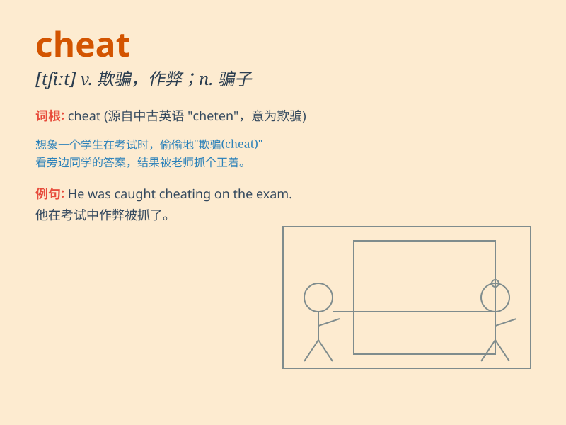

## cheat

**英音:** _[tʃiːt]_ **美音:** _[tʃit]_

**译义:** *n.欺骗,骗子v.欺骗,骗取*

### 短语

+ **cheat on:** _对\...不忠；背着\...出轨_

+ **cheat death:** _死里逃生；逃脱死亡_

+ **cheat sb. out of sth.:** _骗某人某物_

+ **cheat in the exam:** _考试作弊_

+ **cheat in business:** _在生意上欺诈_

### 例句

#### 例句1

> **He was caught cheating in the exam.**

**中文翻译:** 他在考试中作弊被抓住了。

**单词释义:** 作弊

#### 例句2

> **Don\'t cheat on your taxes.**

**中文翻译:** 不要在纳税上作弊。

**单词释义:** 作弊；欺诈

#### 例句3

> **She felt cheated by the salesman\'s false promises.**

**中文翻译:** 她觉得被推销员的虚假承诺欺骗了。

**单词释义:** 欺骗；欺诈

### 背诵小故事

> One day, Tom was playing a game. His opponent tried to cheat by
looking at Tom\'s cards secretly. But Tom was smart and caught him.
Cheating is not fair and honest.

**有一天，汤姆在玩游戏。他的对手试图作弊，偷偷看汤姆的牌。但汤姆很聪明，抓住了他。作弊是不公平和不诚实的。**

### 图义

