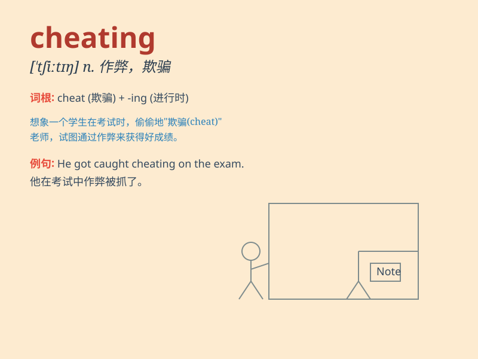

## cheating

**英音:** _null_ **美音:** _null_

**译义:** *null*

### 短语

+ **cheating behavior:** _欺骗行为_

+ **cheating spouse:** _出轨的配偶_

+ **cheating scandal:** _作弊丑闻_

+ **prevent cheating:** _防止作弊_

+ **catch someone cheating:** _抓到某人作弊_

### 例句

#### 例句1

> **I caught him cheating in the exam.**

**中文翻译:** 我发现他在考试中作弊。

**单词释义:** 作弊

#### 例句2

> **She accused him of cheating on her.**

**中文翻译:** 她指责他对她不忠。

**单词释义:** 不忠；欺骗

#### 例句3

> **Cheating is not allowed in this game.**

**中文翻译:** 在这个游戏中作弊是不被允许的。

**单词释义:** 作弊

### 背诵小故事

> One day, Tom was caught cheating in the exam. The teacher was very
angry and punished him. Tom realized that cheating was wrong and
promised never to do it again.

**一天，汤姆在考试中被抓到作弊。老师非常生气并惩罚了他。汤姆意识到作弊是错误的，并承诺再也不这样做了。**

### 图义

