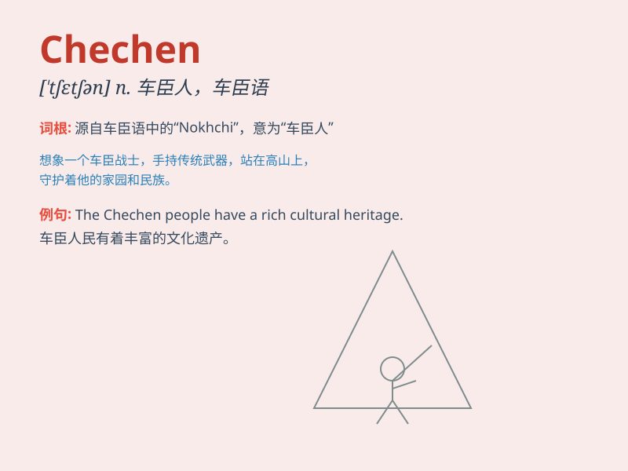

## Chechen

**英音:** _[tʃɛtʃɛn]_ **美音:** _[tʃəˈtʃɛn]_

**译义:** *adj.车臣的；车臣人（或语）的；n.车臣人（或语）*

### 短语

+ **Chechen Republic:** _车臣共和国_

+ **Chechen language:** _车臣语_

+ **Chechen conflict:** _车臣冲突_

+ **Chechen people:** _车臣人_

+ **Chechen separatist:** _车臣分离主义者_

### 例句

#### 例句1

> **The Chechen conflict has had a significant impact on the
region.**

**中文翻译:** 车臣冲突对该地区产生了重大影响。

**单词释义:** 车臣的；车臣人

#### 例句2

> **She is an expert on Chechen history.**

**中文翻译:** 她是车臣历史方面的专家。

**单词释义:** 车臣的

#### 例句3

> **The Chechen people have their own unique culture.**

**中文翻译:** 车臣人民有他们自己独特的文化。

**单词释义:** 车臣的；车臣人

### 背诵小故事

> Once upon a time, a traveler met a friendly Chechen in a distant
land. The Chechen showed the traveler around and shared local customs.
The traveler was deeply impressed by the Chechen\'s kindness.

**从前，一位旅行者在遥远的地方遇到了一位友好的车臣人。这位车臣人带着旅行者四处参观并分享了当地的习俗。旅行者对这位车臣人的友善印象深刻。**

### 图义

