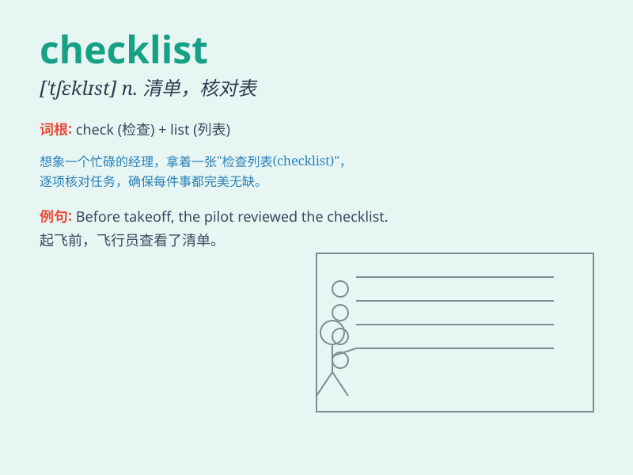

## checklist

**英音:** _[ˈtʃeklɪst]_ **美音:** _[ˈtʃɛklɪst]_

**译义:** *n.检查表；核对单*

### 短语

+ **project checklist:** _项目检查表_

+ **safety checklist:** _安全检查表_

+ **travel checklist:** _旅行清单_

+ **preparation checklist:** _准备清单_

+ **checklist item:** _清单项目_

### 例句

#### 例句1

> **The pilot went through the pre-flight checklist carefully.**

**中文翻译:** 飞行员仔细地查看了飞行前的检查清单。

**单词释义:** 检查清单

#### 例句2

> **Please make a checklist of the items needed for the party.**

**中文翻译:** 请为聚会所需的物品列一个清单。

**单词释义:** 清单

#### 例句3

> **The manager uses a daily checklist to monitor the progress of the
project.**

**中文翻译:** 经理使用每日清单来监控项目的进展。

**单词释义:** 清单

### 背诵小故事

> One day, Tom was assigned a complex project. To ensure everything
went smoothly, he made a checklist. He ticked off each item as he
completed it. Finally, with the help of the checklist, he successfully
finished the project.

**有一天，汤姆被分配了一个复杂的项目。为了确保一切顺利，他制作了一份清单。每完成一项，他就勾选一项。最后，在这份清单的帮助下，他成功地完成了项目。**

### 图义

