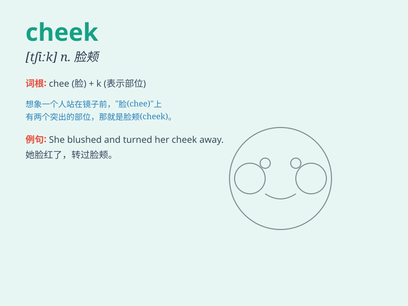

## cheek

**英音:** _[tʃiːk]_ **美音:** _[tʃik]_

**译义:** *n.颊,厚颜,类似颊的事物,\<俚>臀部*

### 短语

+ **cheek by jowl:** _紧密地；亲密地_

+ **turn the other cheek:** _容忍；逆来顺受_

+ **tongue in cheek:** _不当真的；半开玩笑的_

+ **have the cheek to do sth:** _厚着脸皮做某事_

+ **cheek bone:** _颧骨_

### 例句

#### 例句1

> **She kissed him on the cheek.**

**中文翻译:** 她亲吻了他的脸颊。

**单词释义:** 脸颊

#### 例句2

> **Don\'t be cheeky!**

**中文翻译:** 别那么厚脸皮！

**单词释义:** 厚脸皮；无礼

#### 例句3

> **He turned his cheek away when she tried to kiss him.**

**中文翻译:** 当她试图亲吻他时，他把脸转开了。

**单词释义:** 脸颊

### 背诵小故事

> A monkey was very naughty. It climbed up a tree and then jumped down,
landing on its cheek. But it still kept playing happily. Remember, cheek
is the side of your face.

**一只猴子非常顽皮。它爬上树然后跳下来，脸着地了。但它仍然开心地玩耍着。记住，cheek
就是脸颊。**

### 图义

