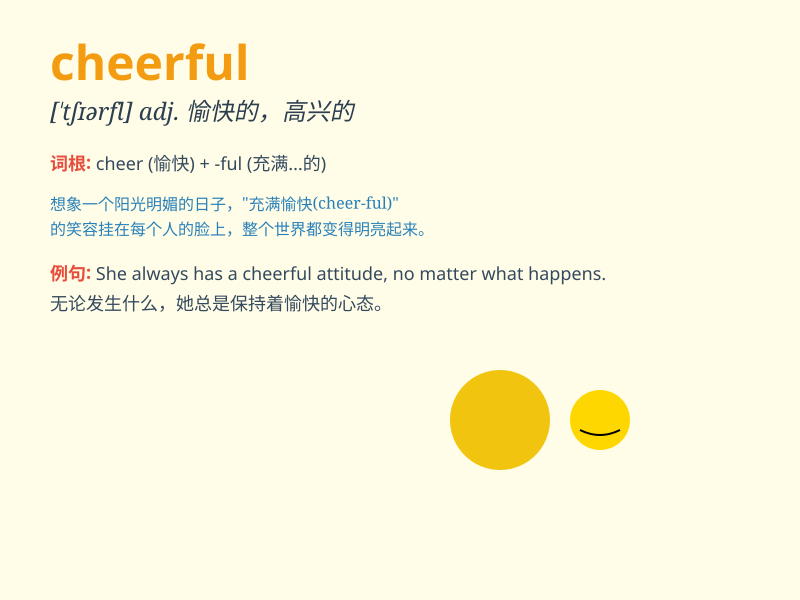

## cheerful

**英音:** _[\'tʃɪəfʊl; -f(ə)l]_ **美音:** _[\'tʃɪrfl]_

**译义:** *adj.愉快的,高兴的*

### 短语

+ **cheerful smile:** _欢快的微笑_

+ **cheerful mood:** _愉快的心情_

+ **cheerful voice:** _欢快的声音_

+ **cheerful atmosphere:** _欢快的气氛_

+ **cheerful personality:** _开朗的性格_

### 例句

#### 例句1

> **She always has a cheerful smile on her face.**

**中文翻译:** 她脸上总是带着欢快的笑容。

**单词释义:** 欢快的；高兴的

#### 例句2

> **The children had a cheerful time playing in the park.**

**中文翻译:** 孩子们在公园里玩得很愉快。

**单词释义:** 愉快的

#### 例句3

> **He remained cheerful despite the difficulties.**

**中文翻译:** 尽管困难重重，他仍然保持着乐观。

**单词释义:** 乐观的

### 背诵小故事

> One day, I was feeling down. Then I met a girl with a big smile. Her
positive attitude and lively spirit made me happy. She was so cheerful
that my mood changed completely. I realized the power of being cheerful.

**有一天，我心情低落。然后我遇到了一个面带灿烂笑容的女孩。她积极的态度和活泼的精神让我开心起来。她是如此的欢快，以至于完全改变了我的心情。我意识到了欢快的力量。**

### 图义

