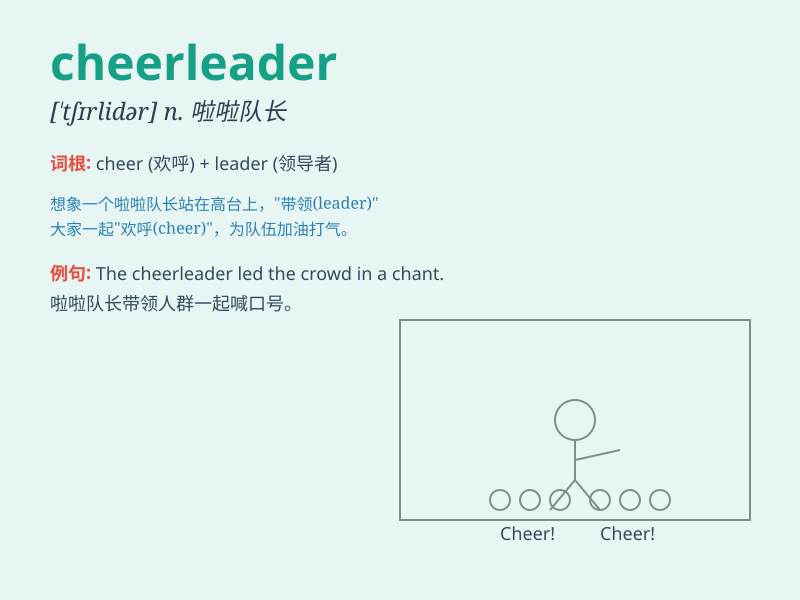

## cheerleader

**英音:** _[\'tʃɪəliːdə]_ **美音:** _[\'tʃɪr\'lidɚ]_

**译义:** *n.啦啦队队长*

### 短语

+ **school cheerleader:** _学校啦啦队队员_

+ **professional cheerleader:** _职业啦啦队队员_

+ **cheerleader squad:** _啦啦队队伍_

+ **head cheerleader:** _啦啦队队长_

+ **cheerleader uniform:** _啦啦队队服_

### 例句

#### 例句1

> **She was the captain of the cheerleader squad.**

**中文翻译:** 她是啦啦队队长。

**单词释义:** 啦啦队队员

#### 例句2

> **The cheerleader led the crowd in a chant.**

**中文翻译:** 这位啦啦队员带领人群高呼。

**单词释义:** 啦啦队员

#### 例句3

> **He has a crush on the new cheerleader.**

**中文翻译:** 他喜欢上了新来的啦啦队员。

**单词释义:** 啦啦队员

### 背诵小故事

> In a big sports game, the team was losing. But the cheerleader kept
shouting and dancing, full of energy, making everyone feel excited. Her
cheers led the team to victory. Remember, a cheerleader brings joy and
motivation!

**在一场大型体育比赛中，队伍处于劣势。但啦啦队长一直充满活力地呼喊和跳舞，让每个人都感到兴奋。她的加油助威带领队伍走向胜利。记住，啦啦队长带来欢乐和动力！**

### 图义

