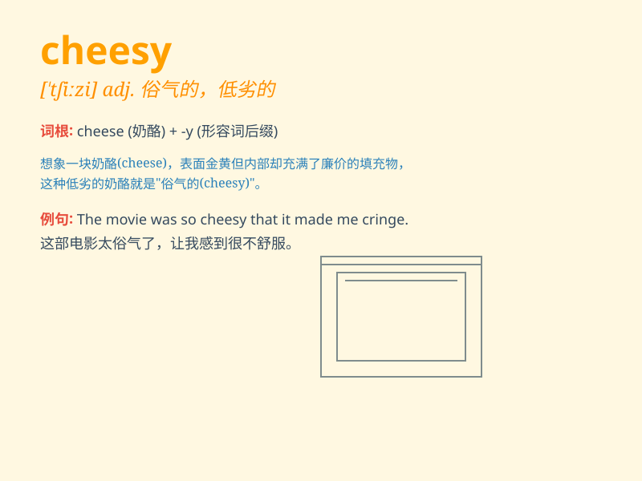

## cheesy

**英音:** _[\'tʃiːzɪ]_ **美音:** _[\'tʃizi]_

**译义:**
*adj.干酪质的,\<美俚>(质量)低劣的,下等的,\<英俚>俊俏的,潇洒的*

### 短语

+ **cheesy smile:** _假笑；不真诚的笑_

+ **cheesy joke:** _低级笑话；庸俗的笑话_

+ **cheesy music:** _庸俗的音乐；质量差的音乐_

+ **cheesy romance:** _俗套的浪漫；老套的爱情故事_

+ **cheesy commercial:** _俗气的广告；质量不佳的商业广告_

### 例句

#### 例句1

> **The movie was so cheesy that I couldn\'t finish watching it.**

**中文翻译:** 这部电影太俗气了，我没能看完。

**单词释义:** 俗气的，质量低劣的

#### 例句2

> **His cheesy pickup lines didn\'t work on her at all.**

**中文翻译:** 他那些俗气的搭讪台词对她根本不起作用。

**单词释义:** 庸俗的，老套的

#### 例句3

> **The cheesy decor in the room made it look cheap.**

**中文翻译:** 房间里俗气的装饰让它看起来很廉价。

**单词释义:** 粗俗的，没品位的

### 背诵小故事

> One day, I went to a party. The decorations were so cheesy, like
cheap plastic flowers and old balloons. It made me think of something of
poor quality or overly tacky. Just like that, I\'ll never forget the
word \'cheesy\'.

**有一天，我去参加一个聚会。装饰非常俗气，比如廉价的塑料花和旧气球。这让我想到了质量差或过于俗气的东西。就这样，我永远不会忘记'cheesy'这个词。**

### 图义

