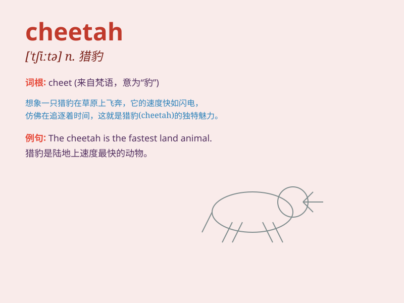

## cheetah

**英音:** _[\'tʃiːtə]_ **美音:** _[\'tʃitə]_

**译义:** *n.[动]印度豹(一种似豹的动物,产于南亚及非洲)*

### 短语

+ **cheetah cub:** _猎豹幼崽_

+ **cheetah speed:** _猎豹的速度_

+ **run like a cheetah:** _像猎豹一样奔跑_

+ **cheetah habitat:** _猎豹的栖息地_

+ **cheetah hunting:** _猎豹狩猎_

### 例句

#### 例句1

> **The cheetah is the fastest land animal.**

**中文翻译:** 猎豹是跑得最快的陆地动物。

**单词释义:** 猎豹

#### 例句2

> **We saw a cheetah chasing after a gazelle in the savannah.**

**中文翻译:** 我们在大草原上看到一只猎豹追赶一只羚羊。

**单词释义:** 猎豹

#### 例句3

> **The cheetah\'s speed and agility make it a remarkable
predator.**

**中文翻译:** 猎豹的速度和敏捷性使其成为非凡的掠食者。

**单词释义:** 猎豹

### 背诵小故事

> A little monkey was playing in the forest when suddenly a cheetah
appeared. The cheetah ran so fast that it scared the monkey. The monkey
climbed up a tree quickly. The cheetah\'s speed is amazing!

**一只小猴子正在森林里玩耍，突然一只猎豹出现了。猎豹跑得非常快，把猴子吓到了。猴子迅速爬上了一棵树。猎豹的速度令人惊叹！**

### 图义

