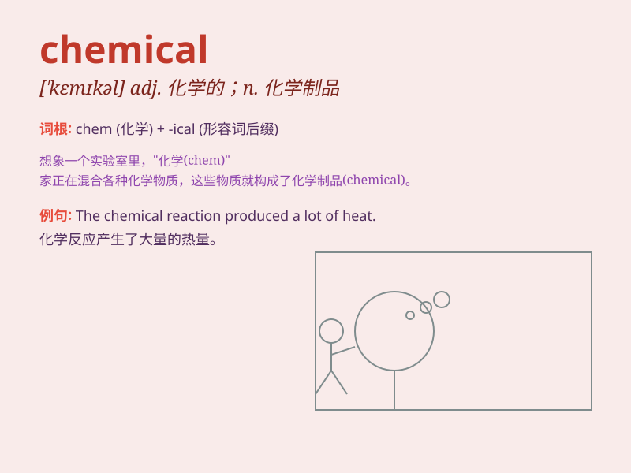

## chemical

**英音:** _[\'kemɪk(ə)l]_ **美音:** _[\'kɛmɪkl]_

**译义:** *adj.化学的n.[常pl.] 化学制品,化学药品n.化学药品*

### 短语

+ **chemical reaction:** _化学反应_

+ **chemical engineering:** _化学工程_

+ **chemical element:** _化学元素_

+ **chemical industry:** _化学工业_

+ **chemical substance:** _化学物质_

### 例句

#### 例句1

> **The factory produces a large quantity of chemical products.**

**中文翻译:** 该工厂生产大量的化工产品。

**单词释义:** 化学的；与化学有关的

#### 例句2

> **Chemical reactions often occur when substances are mixed.**

**中文翻译:** 物质混合时经常会发生化学反应。

**单词释义:** 化学的

#### 例句3

> **He is studying the chemical composition of this mineral.**

**中文翻译:** 他正在研究这种矿物的化学成分。

**单词释义:** 化学的；化学成分的

### 背诵小故事

> A crazy scientist was in his lab. He mixed many substances and
created a new \'chemical\' formula. But be careful, these chemicals can
be dangerous if not handled properly!

**一位疯狂的科学家在他的实验室里。他混合了许多物质，创造出了一种新的"化学"配方。但要小心，如果处理不当，这些化学物质可能会很危险！**

### 图义

