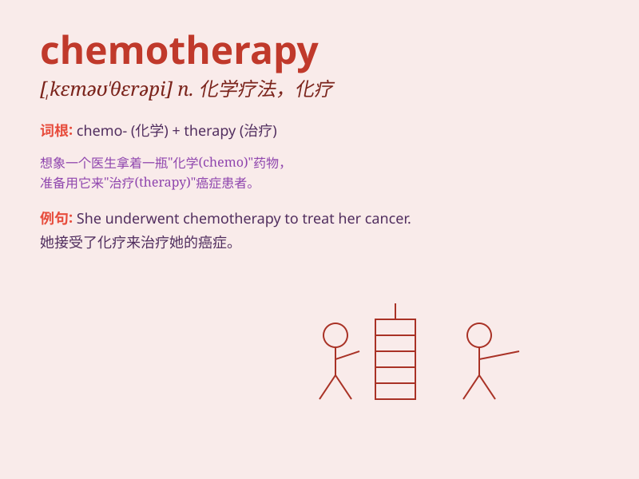

## chemotherapy

**英音:** _[,kiːmə(ʊ)\'θerəpɪ; ,kem-]_ **美音:**
_[,kimo\'θɛrəpi]_

**译义:** *n.化学疗法*

### 短语

+ **chemotherapy drug:** _化疗药物_

+ **chemotherapy session:** _化疗疗程_

+ **undergo chemotherapy:** _接受化疗_

+ **chemotherapy treatment:** _化疗治疗_

+ **chemotherapy side effect:** _化疗副作用_

### 例句

#### 例句1

> **The patient is undergoing chemotherapy to treat the cancer.**

**中文翻译:** 患者正在接受化疗来治疗癌症。

**单词释义:** 化疗

#### 例句2

> **Chemotherapy often causes side effects such as hair loss and
fatigue.**

**中文翻译:** 化疗通常会引起脱发和疲劳等副作用。

**单词释义:** 化疗

#### 例句3

> **After several rounds of chemotherapy, her condition improved
significantly.**

**中文翻译:** 经过几轮化疗后，她的病情明显好转。

**单词释义:** 化疗

### 背诵小故事

> A brave patient named Lily was undergoing chemotherapy. She faced
many challenges but remained strong. The chemo drugs were like soldiers
fighting the bad cells in her body. Eventually, she won the battle
against the illness.

**一位勇敢的名叫莉莉的患者正在接受化疗。她面临诸多挑战但依然坚强。化疗药物就像士兵在她体内与坏细胞作战。最终，她战胜了疾病。**

### 图义

