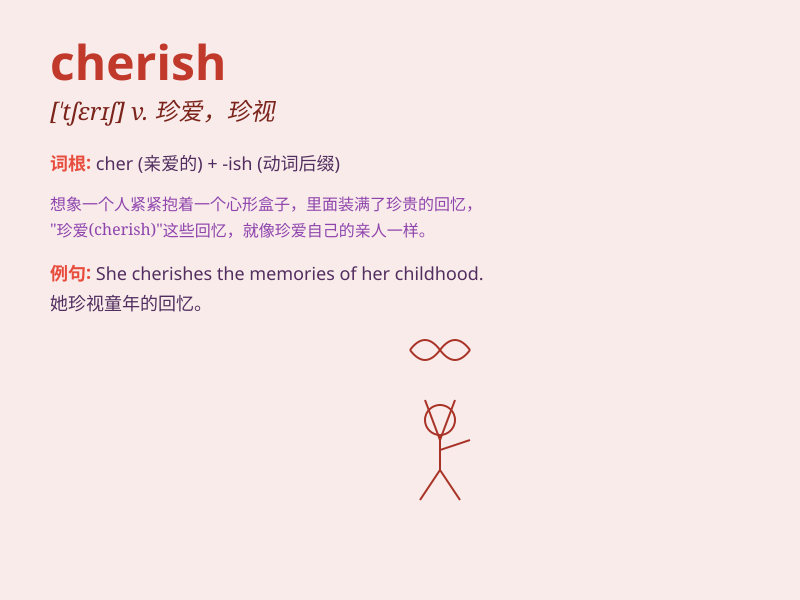

## cherish

**英音:** _[\'tʃerɪʃ]_ **美音:** _[\'tʃɛrɪʃ]_

**译义:** *vt.珍爱,怀抱(希望等)*

### 短语

+ **cherish the memory:** _怀念；铭记_

+ **cherish hope:** _怀有希望_

+ **cherish friendship:** _珍视友谊_

+ **cherish time:** _珍惜时间_

+ **cherish every moment:** _珍惜每一刻_

### 例句

#### 例句1

> **I will always cherish the memories of our time together.**

**中文翻译:** 我将永远珍视我们在一起的时光的回忆。

**单词释义:** 珍视

#### 例句2

> **She cherishes her independence and freedom.**

**中文翻译:** 她珍视她的独立和自由。

**单词释义:** 珍视

#### 例句3

> **We should cherish every moment of life.**

**中文翻译:** 我们应该珍惜生命的每一刻。

**单词释义:** 珍惜

### 背诵小故事

> A little girl found a wounded bird. She cared for it, fed it, and
protected it. She cherished the bird as if it were her most precious
treasure. Finally, the bird recovered and flew away. The girl knew she
had given it the love it needed.

**一个小女孩发现了一只受伤的鸟。她照顾它，给它喂食，保护它。她珍视这只鸟，仿佛它是她最珍贵的宝贝。最后，鸟康复飞走了。女孩知道她给予了它所需的爱。**

### 图义

