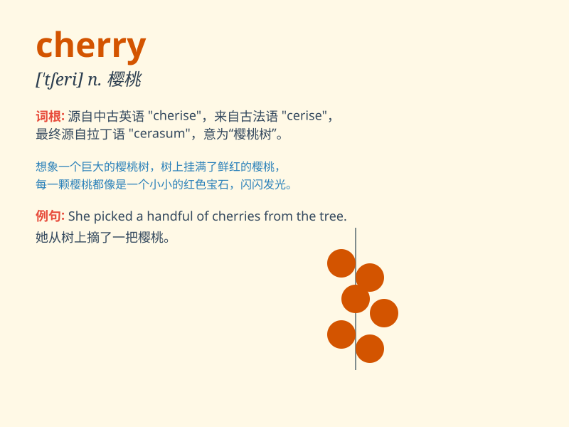

## cherry

**英音:** _[\'tʃerɪ]_ **美音:** _[\'tʃɛri]_

**译义:** *n.樱桃,樱桃树,如樱桃的鲜红色,\<俚,鄙>处女膜,处女*

### 短语

+ **cherry blossom:** _樱花_

+ **cherry pie:** _樱桃派_

+ **cherry tree:** _樱桃树_

+ **cherry red:** _樱桃红_

+ **sweet cherry:** _甜樱桃_

### 例句

#### 例句1

> **She picked a cherry from the tree.**

**中文翻译:** 她从树上摘了一颗樱桃。

**单词释义:** 樱桃

#### 例句2

> **The color of her dress is like a ripe cherry.**

**中文翻译:** 她裙子的颜色像熟透的樱桃。

**单词释义:** 樱桃；樱桃色

#### 例句3

> **Life is not all cherries.**

**中文翻译:** 人生并非事事如意。

**单词释义:** 美好事物；乐事

### 背诵小故事

> A little girl named Cherry was very sweet and loved by everyone. One
day, she picked beautiful cherries from the tree and shared them with
her friends. The red cherries were as charming as she was.

**一个叫 Cherry
的小女孩非常甜美，深受大家喜爱。有一天，她从树上摘了漂亮的樱桃，并和朋友们分享。红红的樱桃就像她一样迷人。**

### 图义

