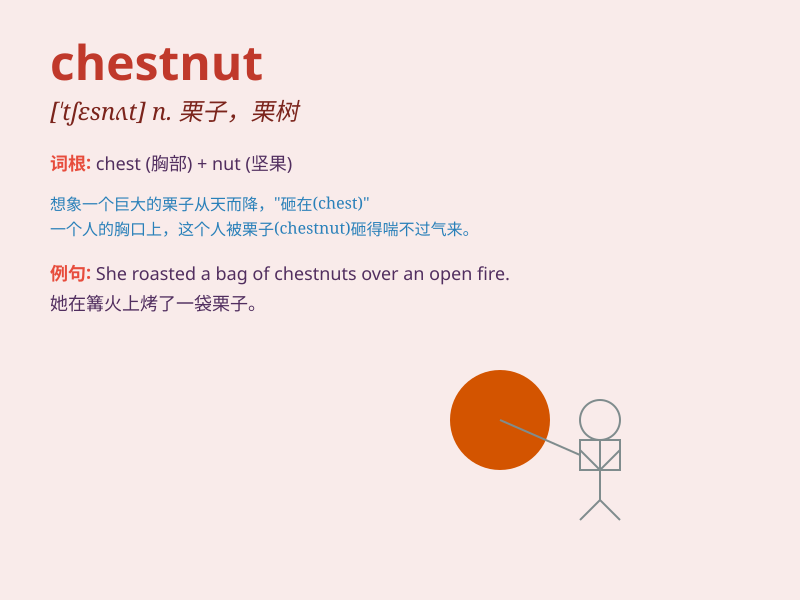

## chestnut

**英音:** _[\'tʃesnʌt]_ **美音:** _[\'tʃɛsnʌt]_

**译义:** *n.栗子*

### 短语

+ **chestnut tree:** _栗树_

+ **chestnut brown:** _栗棕色_

+ **roast chestnut:** _烤栗子_

+ **chestnut horse:** _栗色马_

+ **chestnut wood:** _栗木_

### 例句

#### 例句1

> **The horse has a beautiful chestnut coat.**

**中文翻译:** 这匹马有一身漂亮的栗色皮毛。

**单词释义:** 栗色

#### 例句2

> **We roasted chestnuts over the fire.**

**中文翻译:** 我们在火上烤栗子。

**单词释义:** 栗子

#### 例句3

> **She told me an old chestnut about a lost key.**

**中文翻译:** 她给我讲了一个关于丢失钥匙的老掉牙的故事。

**单词释义:** 老掉牙的故事

### 背诵小故事

> A little squirrel was gathering chestnuts in the forest. It filled
its small chest with these brown nuts to prepare for winter. The
chestnuts were shiny and looked very attractive.

**一只小松鼠在森林里采集栗子。它把这些棕色的栗子装满自己的小胸膛，为冬天做准备。这些栗子闪闪发光，看起来十分诱人。**

### 图义

