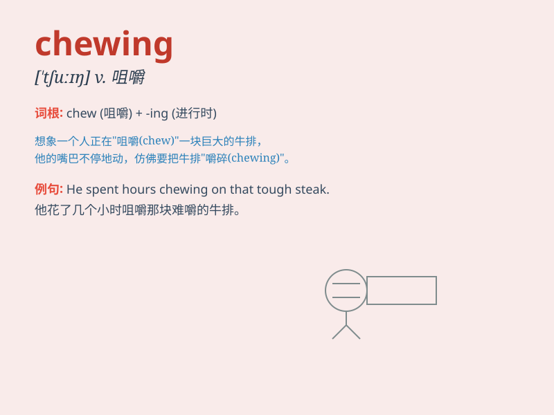

## chewing

**英音:** _[ˈtʃuːɪŋ]_ **美音:** _[ˈtʃuːɪŋ]_

**译义:** *n.咀嚼；咀嚼物；v.咀嚼（chew的现在分词）*

### 短语

+ **chewing gum:** _口香糖_

+ **chewing tobacco:** _嚼用烟草_

+ **keep chewing:** _一直咀嚼_

+ **stop chewing:** _停止咀嚼_

+ **chewing habit:** _咀嚼习惯_

### 例句

#### 例句1

> **The dog was chewing a bone.**

**中文翻译:** 这只狗正在啃一块骨头。

**单词释义:** 咀嚼；咬

#### 例句2

> **She was chewing gum absent-mindedly.**

**中文翻译:** 她心不在焉地嚼着口香糖。

**单词释义:** 咀嚼

#### 例句3

> **He sat there chewing the end of his pen.**

**中文翻译:** 他坐在那儿咬着钢笔头。

**单词释义:** 咬

### 背诵小故事

> One day, a little monkey was chewing a big banana happily. Its mouth
moved up and down, and the juice flowed. Chewing means to crush food in
the mouth with the teeth.

**一天，一只小猴子开心地咀嚼着一根大香蕉。它的嘴巴上下移动，汁水都流出来了。chewing
意思是用牙齿在嘴里把食物嚼碎。**

### 图义

