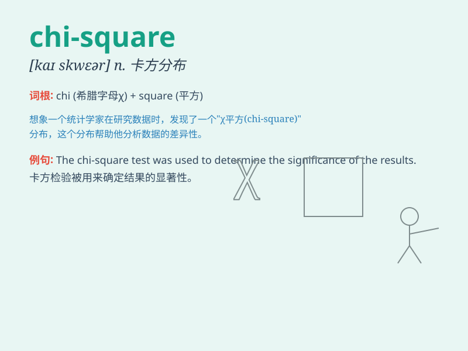

## chi-square

**英音:** _[kaɪ skweə]_ **美音:** _[kaɪ skwer]_

**译义:** *n.
卡方分布，卡方检验（统计学中用于分析分类数据的检验方法）*

### 短语

+ **chi-square test:** _卡方检验_

+ **chi-square distribution:** _卡方分布_

+ **chi-square goodness of fit:** _卡方拟合优度_

+ **chi-square statistic:** _卡方统计量_

+ **chi-square analysis:** _卡方分析_

### 例句

#### 例句1

> **The chi-square test is commonly used in statistical analysis.**

**中文翻译:** 卡方检验在统计分析中被普遍使用。

**单词释义:** 卡方

#### 例句2

> **We applied the chi-square method to determine the
significance.**

**中文翻译:** 我们应用卡方方法来确定其重要性。

**单词释义:** 卡方

#### 例句3

> **The results of the chi-square analysis were quite revealing.**

**中文翻译:** 卡方分析的结果相当有启发性。

**单词释义:** 卡方

### 背诵小故事

> 想象一下，有个叫 Chi
的科学家在一个方形的实验室里做实验，他一直在计算数据，试图找到一种规律。这个实验室和他的计算就被称为
chi-square。

**想象有个叫 Chi 的科学家在方形实验室里做与 chi-square
相关的计算实验。**

### 图义

