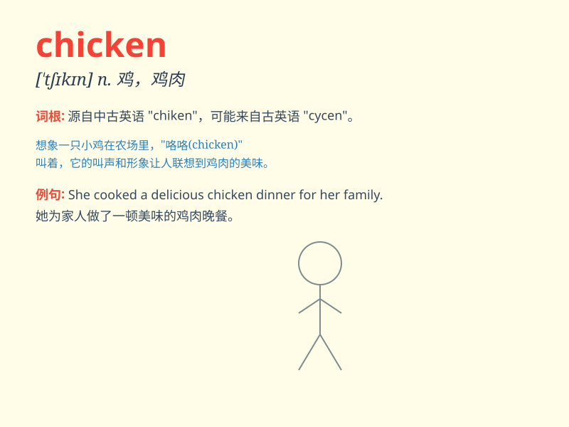

## chicken

**英音:** _[\'tʃɪkɪn]_ **美音:** _[\'tʃɪkən]_

**译义:** *n.小鸡,小鸟,鸡肉*

### 短语

+ **chicken soup:** _鸡汤_

+ **roast chicken:** _烤鸡_

+ **fried chicken:** _炸鸡_

+ **chicken breast:** _鸡胸肉_

+ **chicken wing:** _鸡翅_

### 例句

#### 例句1

> **I\'m too scared to walk home alone in the dark. I\'m such a
chicken!**

**中文翻译:** 我太害怕了，不敢在黑暗中独自走回家。我真是个胆小鬼！

**单词释义:** 胆小鬼，懦夫

#### 例句2

> **The chicken is laying eggs in the coop.**

**中文翻译:** 这只鸡正在鸡舍里下蛋。

**单词释义:** 鸡

#### 例句3

> **Let\'s have fried chicken for dinner.**

**中文翻译:** 我们晚餐吃炸鸡吧。

**单词释义:** 鸡肉

### 背诵小故事

> A little boy was very scared when he saw a big chicken running
towards him. But then he found the chicken was just friendly and wanted
to play. So he wasn\'t afraid anymore and had fun with the chicken.

**一个小男孩看到一只大鸡朝他跑过来时非常害怕。但后来他发现这只鸡很友好，只是想一起玩。所以他不再害怕，并和这只鸡玩得很开心。**

### 图义

