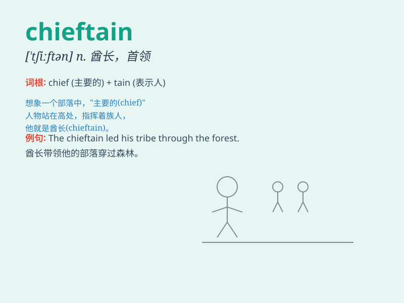

## chieftain

**英音:** _[\'tʃiːft(ə)n; -tɪn]_ **美音:** _[\'tʃiftən]_

**译义:** *n.酋长,首领*

### 短语

+ **chieftain of the tribe:** _部落的首领_

+ **warrior chieftain:** _战士首领_

+ **chieftain of the clan:** _氏族的首领_

+ **rebel chieftain:** _叛军首领_

+ **chieftain of the mountain:** _山区的首领_

### 例句

#### 例句1

> **The chieftain led his tribe through many difficult times.**

**中文翻译:** 这位酋长带领他的部落度过了许多艰难的时期。

**单词释义:** 酋长

#### 例句2

> **The chieftain was respected by all members of the community.**

**中文翻译:** 这位首领受到社区所有成员的尊敬。

**单词释义:** 首领

#### 例句3

> **The chieftain made a decision that would change the fate of his
people.**

**中文翻译:** 这位酋长做了一个将改变他的人民命运的决定。

**单词释义:** 酋长

### 背诵小故事

> In a remote village, there was a chieftain who led the people with
wisdom and courage. He protected the village from invaders and made sure
everyone had enough food. The chieftain was highly respected by all.

**在一个偏远的村庄里，有一位酋长，他凭借智慧和勇气领导着村民。他保护村庄免受侵略者的侵害，并确保每个人都有足够的食物。这位酋长受到了所有人的高度尊敬。**

### 图义

