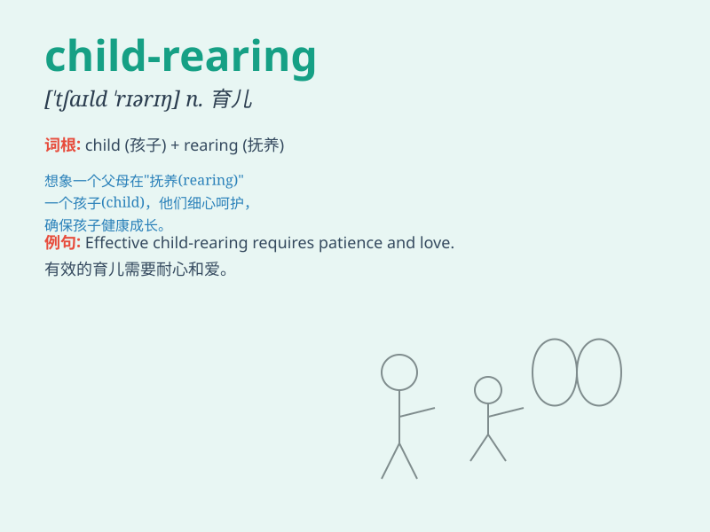

## child-rearing

**英音:** _[tʃaɪld ˈrɪərɪŋ]_ **美音:** _[tʃaɪld ˈrɪrɪŋ]_

**译义:** *n. 育儿，抚养孩子*

### 短语

+ **child-rearing practices:** _育儿实践_

+ **child-rearing methods:** _育儿方法_

+ **child-rearing environment:** _育儿环境_

+ **child-rearing challenges:** _育儿挑战_

+ **child-rearing skills:** _育儿技能_

### 例句

#### 例句1

> **Child-rearing is a challenging but rewarding task for
parents.**

**中文翻译:** 养育孩子对于父母来说是一项具有挑战性但有回报的任务。

**单词释义:** 养育孩子

#### 例句2

> **The couple has different opinions on child-rearing methods.**

**中文翻译:** 这对夫妇在养育孩子的方法上有不同的意见。

**单词释义:** 养育孩子的方式

#### 例句3

> **She read many books on child-rearing to become a better
mother.**

**中文翻译:** 她读了很多关于养育孩子的书，以成为一个更好的母亲。

**单词释义:** 养育孩子

### 背诵小故事

> A couple was facing many challenges in child-rearing. They had to
deal with tantrums, teach good manners, and ensure the kids were safe.
But with love and patience, they managed to create a happy family.

**一对夫妇在养育孩子方面面临着许多挑战。他们得应对孩子发脾气，教导良好的礼仪，并确保孩子的安全。但凭借爱和耐心，他们成功营造了一个幸福的家庭。**

### 图义

