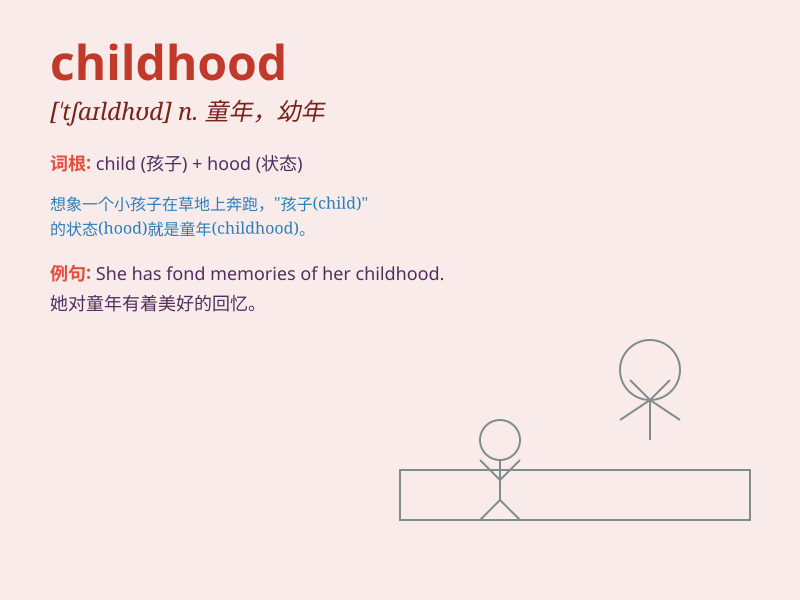

## childhood

**英音:** _[\'tʃaɪldhʊd]_ **美音:** _[\'tʃaɪldhʊd]_

**译义:** *n.孩童时期*

### 短语

+ **happy childhood:** _快乐的童年_

+ **childhood memories:** _童年回忆_

+ **early childhood:** _幼儿时期_

+ **childhood friend:** _童年好友_

+ **childhood dream:** _童年梦想_

### 例句

#### 例句1

> **My childhood was filled with happy memories.**

**中文翻译:** 我的童年充满了快乐的回忆。

**单词释义:** 童年时期

#### 例句2

> **She often thinks back to her childhood in the countryside.**

**中文翻译:** 她经常回想起在农村的童年时光。

**单词释义:** 童年

#### 例句3

> **The photos brought back memories of his childhood.**

**中文翻译:** 这些照片唤起了他对童年的记忆。

**单词释义:** 童年

### 背诵小故事

> Once upon a time, a little child named Lily had many wonderful
memories. She played in the garden, had birthday parties, and went on
adventures. All these memories formed her childhood, a time full of joy
and innocence.

**从前，有个叫莉莉的小孩有很多美好的回忆。她在花园里玩耍，举办生日派对，还去冒险。所有这些回忆构成了她的童年，一段充满欢乐和纯真的时光。**

### 图义

