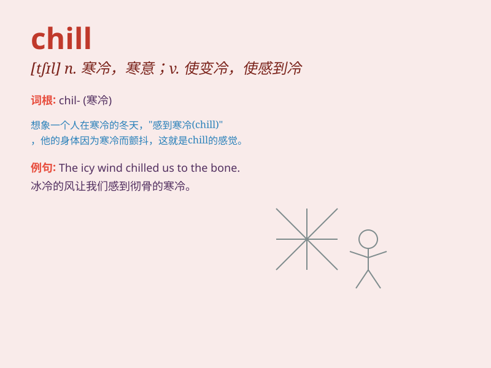

## chill

**英音:** _[tʃɪl]_ **美音:** _[tʃɪl]_

**译义:** *n.寒意,寒战,寒心adj.寒冷的,扫兴的v.使冷,变冷,冷藏*

### 短语

+ **chill out:** _放松，冷静下来_

+ **catch a chill:** _着凉，受寒_

+ **chill to the bone:** _寒气刺骨_

+ **put the chill on:** _使扫兴，使沮丧_

+ **chill factor:** _风寒因素_

### 例句

#### 例句1

> **The wind made me feel a chill.**

**中文翻译:** 风让我感到一阵寒意。

**单词释义:** 寒冷；寒意

#### 例句2

> **Let\'s just chill at home and watch a movie.**

**中文翻译:** 咱们就在家放松放松，看个电影。

**单词释义:** 放松；休息

#### 例句3

> **The news of his illness gave me a chill.**

**中文翻译:** 他生病的消息让我感到一阵不安。

**单词释义:** 不安；害怕

### 背诵小故事

> A cold winter day, I was outside feeling a strong CHILL. My teeth
chattered and I shivered. I quickly went home to get warm. Remember
this, and you\'ll know \'chill\' means cold and making you shiver.

**一个寒冷的冬日，我在外面感受到强烈的寒意。我的牙齿打颤，身体发抖。我赶紧回家取暖。记住这个，你就会知道'chill'意思是寒冷、使人颤抖。**

### 图义

