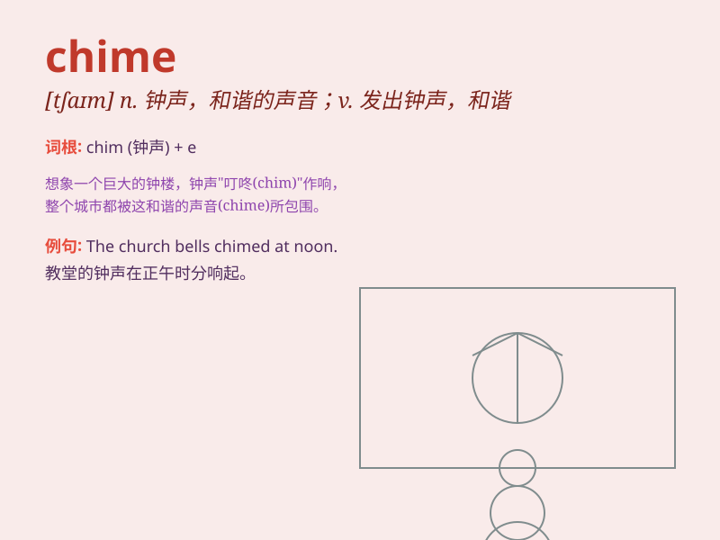

## chime

**英音:** _[tʃaɪm]_ **美音:** _[tʃaɪm]_

**译义:**
*n.一套发谐音的钟(尤指教堂内的),和谐vi.鸣,打,和谐vt.敲出和谐的声音,打钟报时*

### 短语

+ **chime in:** _插话；附和_

+ **chime with:** _与\...协调；与\...一致_

+ **wind chime:** _风铃_

+ **chime clock:** _报时钟_

+ **chime bar:** _音条_

### 例句

#### 例句1

> **The church bells chimed at midnight.**

**中文翻译:** 教堂的钟在午夜敲响。

**单词释义:** （钟、铃等）鸣响

#### 例句2

> **Her opinions chimed perfectly with mine.**

**中文翻译:** 她的意见与我的完全一致。

**单词释义:** 与\...一致；协调

#### 例句3

> **The clock chimed three times.**

**中文翻译:** 钟响了三下。

**单词释义:** （钟）报时

### 背诵小故事

> A little bird was sitting on a tree branch. Every hour, it would
chime like a bell to tell the time. Its beautiful sound made people feel
happy and peaceful.

**一只小鸟坐在树枝上。每个小时，它都会像铃铛一样鸣响来报时。它美妙的声音让人们感到快乐和平静。**

### 图义

